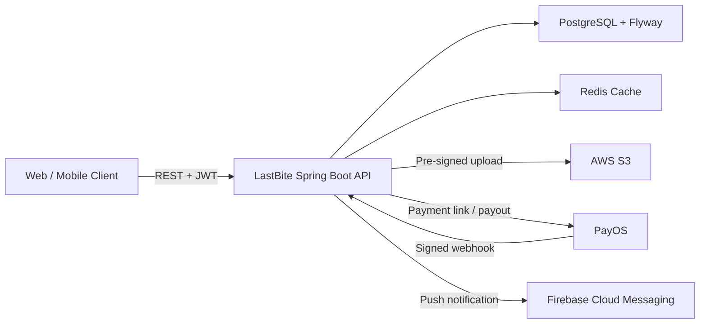
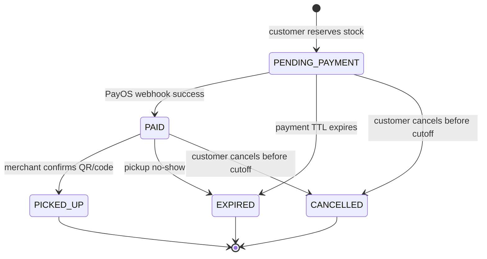
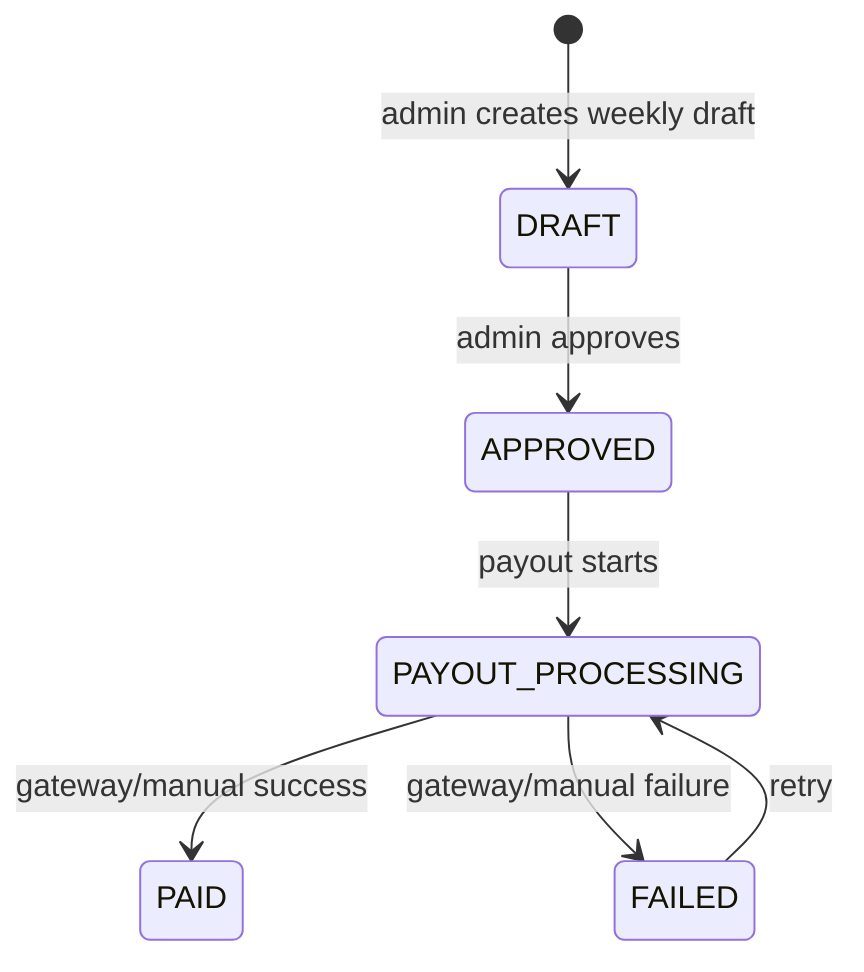

# LastBite Backend

[](https://openjdk.org/projects/jdk/21/)
[](https://spring.io/projects/spring-boot)
[](https://www.postgresql.org/)
[](https://redis.io/)
[](https://www.docker.com/)

LastBite is a food rescue marketplace backend inspired by platforms like Too Good To Go. It helps restaurants, bakeries, cafes, and grocery stores sell surplus food as time-limited surprise bags while giving customers a lower-cost way to reduce food waste.

This repository contains the Spring Boot backend API for authentication, merchant onboarding, store verification, surprise bag inventory, reservation-based checkout, PayOS payments, QR/code pickup, refunds, ratings, notifications, and merchant settlement.

## Why This Project Matters

LastBite is not a simple CRUD demo. The backend models several production-grade marketplace problems:

- Preventing oversell when many customers reserve the same last bag at the same time.
- Keeping payment state trustworthy by relying on signed PayOS webhooks, not browser redirects.
- Separating customer payment capture from merchant payout through an escrow-style ledger.
- Supporting T+3 merchant payable availability and weekly settlement workflows.
- Handling pickup verification through one-time QR tokens and manual pickup codes.
- Maintaining audit trails for order state changes, refunds, review moderation, and payouts.
- Designing merchant onboarding with document uploads, bank accounts, review states, and store versioning.

## Core Capabilities

### Customer Experience

- Email/password registration with email verification.
- Google ID token login.
- HttpOnly refresh token cookie with rotating refresh sessions.
- Profile, address book, and favorite stores.
- Public store and bag discovery by location, district, category, diet type, bag type, price, distance, and pickup time.
- Reservation-based ordering with stock held immediately.
- PayOS checkout link and QR payment support.
- Pickup code and QR token returned after reservation creation.
- Customer cancellation before pickup cutoff.
- Refund/dispute request after completed or expired orders.
- Review and rating flow after pickup, including category scores for collection, quality, variety, and quantity.
- In-app notification inbox and Firebase Cloud Messaging device registration.

### Merchant Experience

- Merchant owner registration and onboarding.
- Business profile management for individual, household business, company, and company branch legal types.
- Private document upload through S3 pre-signed URLs.
- Bank account registration with encrypted account number storage.
- Multi-store management for merchant owners.
- Store schedule, closure days, and special hours.
- Surprise bag creation with price tier snapshots, pickup windows, packaging details, diet type, bag type, and availability days.
- Daily stock management with stock audit logs.
- Manager/staff account creation with temporary password and forced first login password change.
- Store member workspace and pickup confirmation by QR or manual code.
- Merchant settlement, payout history, and payable balance views.

### Admin and Operations

- Store review workflow: approve, reject, or request changes.
- Store/business profile version review for sensitive post-approval changes.
- Bag price tier management.
- Refund review with full or partial approval.
- Review report resolution and review hiding.
- Weekly settlement draft creation, approval, payout initiation, and manual payout reconciliation.
- Admin audit logging for sensitive financial and moderation actions.
- Scheduled jobs for token cleanup, daily stock creation, stock expiry, payment expiry, pickup no-show, and reminders.

## Architecture Overview



The application is organized by business module under `src/main/java/com/LastBite/modules`.

```text
modules/
  audit/          order status history and admin audit logs
  auth/           registration, login, JWT, refresh token, email verification
  bag/            surprise bags, price tiers, discovery, daily stock
  ledger/         escrow, platform revenue, merchant payable ledger entries
  media/          S3 upload orchestration and media metadata
  merchant/       business profiles, bank accounts, store staff, access control
  notification/   inbox, device tokens, FCM dispatch, reminder jobs
  order/          customer reservation and order lifecycle
  payment/        PayOS gateway, payment transactions, webhooks
  pickup/         QR/manual code pickup and no-show handling
  refund/         refund requests, review, refund transactions
  review/         ratings, review photos, review reports, rating summaries
  settlement/     merchant settlements and PayOS payouts
  store/          store profile, public search, schedules, calendar exceptions
  user/           profile, addresses, favorite stores
```

## Tech Stack

| Area | Technology |
| --- | --- |
| Language | Java 21 |
| Framework | Spring Boot 4.0.6 |
| API | Spring Web MVC, OpenAPI/Swagger |
| Security | Spring Security, OAuth2 Resource Server, JWT, HttpOnly refresh cookies |
| Persistence | Spring Data JPA, Hibernate, PostgreSQL |
| Migration | Flyway |
| Cache | Redis |
| Media | AWS S3 pre-signed uploads |
| Payment | PayOS payment link, signed webhook, payout adapter |
| Notification | Firebase Admin SDK / FCM |
| Build | Maven Wrapper |
| Container | Docker, Docker Compose |
| CI | GitHub Actions, Maven test, JaCoCo report |

## Key Engineering Decisions

### Reservation-first inventory control

When a customer creates an order, the backend locks the daily stock row with a pessimistic write, increments `reserved`, and returns the same checkout for duplicate idempotency keys. This protects the marketplace from overselling the same limited inventory.

### Webhook-driven payment state

The PayOS return URL is treated as a UI navigation signal only. The backend changes payment/order state only after verifying the PayOS webhook signature, matching the provider order code, and validating the amount.

### Escrow-style money flow

Customer payments are captured into platform cash and escrow ledger accounts. Merchant payable is created only after pickup or no-show completion, with a T+3 availability delay before weekly settlement.

### Pickup verification

Each order receives a short manual pickup code and a long QR token. The backend stores hashes and validates either credential during merchant pickup confirmation. A pickup can only be confirmed for the correct store and within the pickup window plus a 15-minute grace period.

### Auditability

Order transitions are recorded in `order_status_history`. Sensitive admin operations such as refund review, review moderation, settlement approval, and payout reconciliation are recorded in `admin_audit_logs`.

## Main Business Flows

### Order and Payment



### Merchant Settlement



## API Highlights

Swagger UI is available locally after startup:

```text
http://localhost:8080/swagger-ui/index.html
```

Selected endpoint groups:

| Group | Endpoints |
| --- | --- |
| Auth | `/api/v1/auth/**` |
| Users | `/api/v1/users/**` |
| Public stores | `/api/v1/stores`, `/api/v1/stores/{slug}` |
| Public bags | `/api/v1/bags/today`, `/api/v1/bags/nearby`, `/api/v1/bags/{bagId}` |
| Merchant stores | `/api/v1/merchant/stores/**` |
| Merchant bags | `/api/v1/merchant/bags/**` |
| Orders | `/api/v1/orders/**` |
| PayOS webhook | `/api/v1/payments/payos/webhook` |
| Pickup | `/api/v1/merchant/pickups/confirm` |
| Refunds | `/api/v1/refunds/**`, `/api/v1/admin/refunds/**` |
| Reviews | `/api/v1/orders/{orderId}/reviews`, `/api/v1/stores/{storeId}/rating-summary` |
| Settlement | `/api/v1/merchant/settlements/**`, `/api/v1/admin/settlements/**` |
| Notifications | `/api/v1/notifications/**` |
| Media | `/api/v1/media/uploads/**` |

For a fuller frontend integration map, see [Frontend Business Flows](docs/frontend_business_flows.md).

## Database and Migrations

The database schema is managed by Flyway:

```text
src/main/resources/db/migration
```

Current schema areas include:

- Auth users, roles, refresh tokens, email verification tokens.
- User profiles, addresses, favorite stores.
- Merchant business profiles, bank accounts, documents, review applications, staff members.
- Stores, schedules, closure days, special hours, reliability stats.
- Surprise bags, price tiers, daily stock, stock audit logs.
- Orders, payment records, payment transactions, payment webhooks, gateway requests.
- Pickup events, refund requests, refund transactions.
- Reviews, review photos, review reports, store rating summaries.
- Ledger accounts, ledger entries, platform commissions, merchant settlements, store payouts.
- Notifications, notification devices, delivery logs, preferences.

The DBML reference is available at [docs/database-reference.local.dbml](docs/database-reference.local.dbml).

## Getting Started

### Prerequisites

- Java 21
- Docker and Docker Compose
- Maven Wrapper included in this repository
- PostgreSQL and Redis if not using Docker Compose

### 1. Clone the repository

```bash
git clone <repository-url>
cd LastBite_BE
```

### 2. Option A - Run the whole stack with Docker

This is the fastest way to run the project locally. Docker Compose starts PostgreSQL, Redis, and the Spring Boot backend.

```bash
docker compose up -d --build
```

Check backend logs:

```bash
docker compose logs -f backend
```

Check container status:

```bash
docker compose ps
```

The API should be available at:

```text
http://localhost:8080
```

Useful local URLs:

| Purpose | URL |
| --- | --- |
| Health check | `http://localhost:8080/actuator/health` |
| Swagger UI | `http://localhost:8080/swagger-ui/index.html` |
| OpenAPI JSON | `http://localhost:8080/v3/api-docs` |

Stop all containers:

```bash
docker compose down
```

Reset all local Docker data, including PostgreSQL and Redis volumes:

```bash
docker compose down -v
```

### 3. Option B - Run PostgreSQL/Redis with Docker and the app locally

Use this mode when actively developing backend code from the IDE.

Create a local environment file:

```bash
cp .env.example .env
```

On Windows PowerShell:

```powershell
Copy-Item .env.example .env
```

At minimum, configure:

```env
SPRING_DATASOURCE_URL=jdbc:postgresql://localhost:5432/lastbite
SPRING_DATASOURCE_USERNAME=postgres
SPRING_DATASOURCE_PASSWORD=postgres
SPRING_DATA_REDIS_HOST=localhost
SPRING_DATA_REDIS_PORT=6379
JWT_SIGNER_KEY=<base64-encoded-random-secret>
ADMIN_PASSWORD=<strong-admin-password>
APP_PAYMENTS_GATEWAY=fake
```

Start only PostgreSQL and Redis:

```bash
docker compose up postgres redis -d
```

Run the backend locally:

```bash
./mvnw spring-boot:run
```

Windows PowerShell:

```powershell
.\mvnw.cmd spring-boot:run
```

### 4. Run without Docker Compose

If PostgreSQL and Redis are already installed locally, create a PostgreSQL database named `lastbite`, update `.env`, and run:

```bash
./mvnw spring-boot:run
```

Windows:

```powershell
.\mvnw.cmd spring-boot:run
```

Flyway runs database migrations automatically on application startup.

### Local development commands

Rebuild the application:

```bash
./mvnw clean package
```

Run tests:

```bash
./mvnw test
```

Tail Docker backend logs:

```bash
docker compose logs -f backend
```

Open a PostgreSQL shell in the Docker container:

```bash
docker exec -it lastbite-postgres psql -U postgres -d lastbite
```

Open Redis CLI:

```bash
docker exec -it lastbite-redis redis-cli
```

### Troubleshooting local startup

| Problem | Fix |
| --- | --- |
| Port `8080` is already in use | Change `SERVER_PORT` in `.env` or stop the process using the port. |
| Database connection fails | Ensure `docker compose up postgres redis -d` is running and `.env` points to `localhost:5432`. |
| Redis connection fails | Ensure Redis container is healthy and `.env` has `SPRING_DATA_REDIS_HOST=localhost`. |
| JWT startup/config error | Set a non-empty `JWT_SIGNER_KEY` in `.env`. |
| PayOS credentials missing | Keep `APP_PAYMENTS_GATEWAY=fake` for local development. |

### Docker Compose services

| Service | Container | Port | Purpose |
| --- | --- | --- | --- |
| `postgres` | `lastbite-postgres` | `5432` | PostgreSQL database |
| `redis` | `lastbite-redis` | `6379` | Redis cache/session support |
| `backend` | `lastbite-backend` | `8080` | Spring Boot API |

## Environment Variables

Important variables are listed in `.env.example`. The most relevant groups are:

| Group | Variables |
| --- | --- |
| Server | `SERVER_PORT`, `SPRING_PROFILES_ACTIVE` |
| Database | `SPRING_DATASOURCE_URL`, `SPRING_DATASOURCE_USERNAME`, `SPRING_DATASOURCE_PASSWORD` |
| Redis | `SPRING_DATA_REDIS_HOST`, `SPRING_DATA_REDIS_PORT`, `SPRING_DATA_REDIS_TIMEOUT` |
| JWT | `JWT_SIGNER_KEY`, `JWT_ACCESS_TOKEN_DURATION`, `JWT_REFRESH_TOKEN_DURATION` |
| CORS | `APP_CORS_ALLOWED_ORIGINS` |
| Auth cookie | `APP_AUTH_REFRESH_COOKIE_SECURE`, `APP_AUTH_REFRESH_COOKIE_SAME_SITE` |
| Email | `APP_MAIL_PROVIDER`, `APP_MAIL_FROM_ADDRESS`, `APP_MAIL_REPLY_TO`, `MAIL_HOST`, `MAIL_PORT`, `MAIL_USERNAME`, `MAIL_PASSWORD`, `RESEND_API_KEY`, `RESEND_WEBHOOK_SECRET` |
| S3 | `AWS_ACCESS_KEY_ID`, `AWS_SECRET_ACCESS_KEY`, `AWS_REGION`, `AWS_S3_BUCKET_NAME` |
| FCM | `APP_FCM_ENABLED`, `APP_FCM_CREDENTIALS_PATH`, `APP_FCM_CREDENTIALS_BASE64` |
| Payments | `APP_PAYMENTS_GATEWAY`, `PAYOS_CLIENT_ID`, `PAYOS_API_KEY`, `PAYOS_CHECKSUM_KEY` |

Do not commit `.env` or any provider credentials.

For production email, use a verified sending domain such as `mail.lastbite.vn`
with SPF, DKIM, and DMARC DNS records before setting `APP_MAIL_PROVIDER=RESEND`.
The auth endpoints stay the same for FE; only excessive resend/register attempts
may now return `429`.

## Running Tests

```bash
./mvnw test
```

Windows:

```powershell
.\mvnw.cmd test
```

Generate a JaCoCo report:

```bash
./mvnw clean test jacoco:report
```

The current test suite covers representative service behavior such as admin seeding, bag pricing, bag discovery, surprise bag inventory, media upload, order creation, and favorite stores.

## CI/CD

GitHub Actions workflows are included under `.github/workflows`:

- `backend-ci-main.yaml`: runs Maven tests and JaCoCo on pushes to `main`.
- `backend-ci-pr.yaml`: runs Maven tests and JaCoCo for pull requests.
- `backend-cd.yaml`: deployment workflow.
- AI-assisted review/docs workflows for repository automation.

## Production Notes

- Use `APP_PAYMENTS_GATEWAY=payos` only with real PayOS credentials.
- PayOS payment confirmation must be webhook-driven; do not trust the browser return URL for financial state.
- Keep `APP_AUTH_REFRESH_COOKIE_SECURE=true` in HTTPS environments.
- Set restrictive CORS origins for staging/production.
- Keep `APP_FCM_ENABLED=false` unless Firebase credentials are configured.
- Use a real S3 bucket and private document access for merchant documents.
- Monitor payment expiry, pickup no-show, settlement payout, and FCM delivery jobs.

## Current Roadmap / Known Gaps

These are intentionally called out so reviewers can distinguish implemented scope from planned product work:

- Voucher and campaign engine is not implemented yet; orders currently keep `discountAmount` but no voucher API exists.
- Refund approval creates pending refund transactions and ledger liability; a production refund payout worker/manual reconciliation flow still needs to finalize money movement to the customer.
- Bank account registration exists, but an admin bank account approval API is still needed for a complete payout operations UI.
- Order status history and admin audit logs are recorded, but list/search APIs for these logs are not exposed yet.
- `READY_FOR_PICKUP` exists in the order enum, but the current backend does not expose a merchant action to move orders into that state.

## Documentation

Additional project documentation:

- [Frontend Business Flows](docs/frontend_business_flows.md)
- [Database Reference DBML](docs/database-reference.local.dbml)
- [Auth Frontend Flow](docs/auth_frontend_flow.md)
- [S3 Media Upload](docs/s3_media_upload.md)
- [Notifications and FCM](docs/notifications_fcm.md)

## License

This repository is part of the LastBite project. Add the final license before public distribution.
