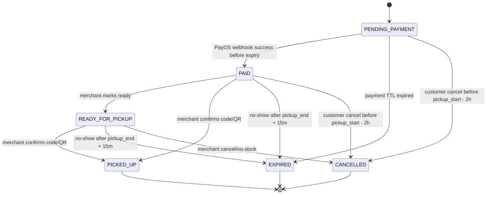
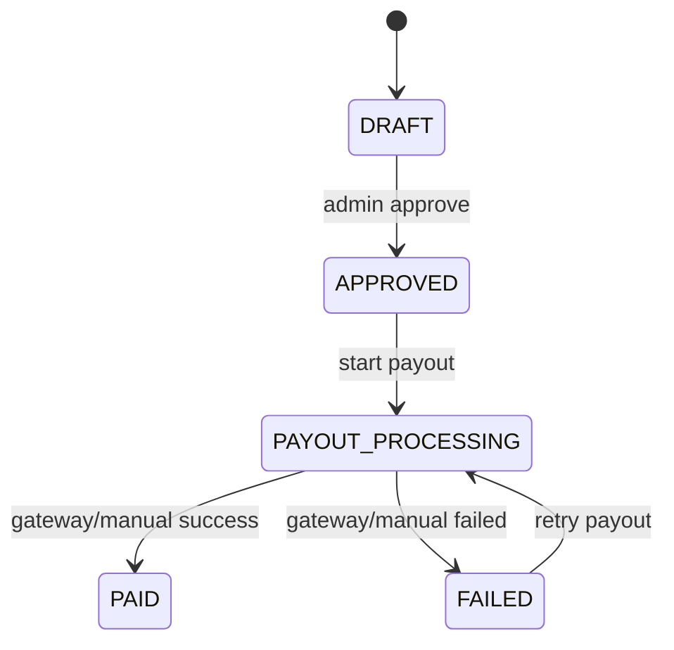

# LastBite Frontend Business Flows

Tài liệu này gom các nghiệp vụ đang có trong codebase hiện tại để FE dùng làm bản đồ tích hợp. Phạm vi rà soát gồm `src/main/java/com/LastBite/modules`, các controller, service, DTO request/response, enum trạng thái và các scheduled job.

Tài liệu chỉ mô tả tính năng đã có trong code hiện tại. Những phần chưa có trong code hoặc còn cần xử lý ngoài code được ghi riêng ở cuối để FE không tích hợp nhầm.

## 0. Quy Ước Chung

### API wrapper

Tất cả API trả về `ApiResponse`:

```json
{
  "code": 1000,
  "message": "Success",
  "result": {},
  "errors": null,
  "timestamp": "2026-06-16T...",
  "path": null
}
```

Với phân trang nội bộ, payload thường là `PageResponse`:

```json
{
  "content": [],
  "page": 0,
  "size": 20,
  "totalElements": 0,
  "totalPages": 0
}
```

Riêng một số endpoint Spring Data trả trực tiếp `Page<T>` trong `result`, ví dụ public store search.

### Auth header và refresh cookie

- FE gửi access token bằng `Authorization: Bearer <access_token>`.
- Refresh token nằm trong cookie HttpOnly `refresh_token`.
- Các request cần gửi cookie, nhất là `/api/v1/auth/refresh`, phải bật `withCredentials: true` hoặc `credentials: "include"`.
- `returnUrl` của PayOS chỉ dùng để FE quay về màn hình kết quả. FE không được tự coi đơn đã thanh toán chỉ vì người dùng quay về URL này; trạng thái tiền chỉ đổi qua webhook PayOS đã verify signature.

### Roles và loại tài khoản

| Role | Ý nghĩa FE |
| --- | --- |
| `CUSTOMER` | Khách hàng đặt túi, thanh toán, pickup, review, refund |
| `MERCHANT_OWNER` | Chủ merchant, quản lý business profile, store, bank, settlement |
| `MANAGER` | Nhân viên quản lý store, có quyền tạo bag scoped, quản lý staff, pickup |
| `STAFF` | Nhân viên store, chủ yếu xem workspace/bag scoped và confirm pickup |
| `ADMIN` | Duyệt store, refund, review report, settlement, broadcast |

`AccountType` có 2 loại:

- `PLATFORM`: customer, merchant owner, admin.
- `STORE_MEMBER`: manager/staff đăng nhập bằng username qua store-login.

## 1. Auth, Đăng Ký, Đăng Nhập, Session

### Endpoint map

| Method | Endpoint | Role | Mục đích |
| --- | --- | --- | --- |
| `POST` | `/api/v1/auth/register` | Public | Đăng ký customer |
| `POST` | `/api/v1/auth/register-merchant` | Public | Đăng ký tài khoản merchant owner, chưa tạo store |
| `POST` | `/api/v1/auth/register-partner` | Public | Legacy one-step: tạo merchant owner + store draft |
| `POST` | `/api/v1/auth/verify-email` | Public | Verify bằng OTP |
| `GET` | `/api/v1/auth/verify-email-link?token=...` | Public | Verify bằng email link |
| `POST` | `/api/v1/auth/resend-otp` | Public | Gửi lại OTP |
| `POST` | `/api/v1/auth/resend-verification-link` | Public | Gửi lại link verify |
| `POST` | `/api/v1/auth/login` | Public | Login platform account bằng email/password |
| `POST` | `/api/v1/auth/store-login` | Public | Login store member bằng username/password |
| `POST` | `/api/v1/auth/change-initial-password` | Authenticated store member | Đổi mật khẩu bắt buộc lần đầu |
| `POST` | `/api/v1/auth/google` | Public | Login/register bằng Google ID token |
| `POST` | `/api/v1/auth/refresh` | Refresh cookie | Rotate refresh token và cấp access token mới |
| `POST` | `/api/v1/auth/logout` | Authenticated | Logout current session |
| `POST` | `/api/v1/auth/logout-all` | Authenticated | Revoke toàn bộ refresh token của user |
| `GET` | `/api/v1/auth/me` | Authenticated | Lấy user hiện tại |

### Luồng customer đăng ký

1. FE gọi `POST /api/v1/auth/register` với `email`, `password`, `fullName`, `phone`.
2. Backend tạo user role `CUSTOMER`, `emailVerified=false`, `status=ACTIVE`.
3. Backend gửi email verification link/OTP.
4. FE chuyển user sang màn hình kiểm tra email.
5. User verify bằng `POST /verify-email` hoặc `GET /verify-email-link`.
6. Backend đánh dấu email verified, trả `access_token`, set cookie `refresh_token`.
7. FE lưu access token trong auth state và gọi `/auth/me` nếu cần hydrate user.

### Luồng merchant owner đăng ký

1. FE gọi `POST /api/v1/auth/register-merchant`.
2. Backend tạo account role `MERCHANT_OWNER`, chưa tạo store.
3. Merchant verify email tương tự customer.
4. Sau login, FE đưa merchant qua onboarding: business profile, upload giấy tờ, bank account, store, schedule, submit review.

### Luồng partner legacy

1. FE gọi `POST /api/v1/auth/register-partner`.
2. Backend tạo merchant owner và tạo store ở trạng thái `DRAFT`.
3. User vẫn phải verify email trước khi login đầy đủ.
4. Luồng này phù hợp màn hình onboarding cũ. Luồng mới nên dùng `register-merchant` rồi tạo từng phần rõ ràng.

### Luồng store member login

1. Owner/manager tạo member bằng API merchant members.
2. Backend trả `temporaryPassword` đúng một lần trong response tạo member.
3. Nhân viên gọi `POST /api/v1/auth/store-login` với `username`, `password`.
4. Nếu `mustChangePassword=true`, FE bắt buộc chuyển sang màn hình đổi mật khẩu lần đầu.
5. FE gọi `POST /api/v1/auth/change-initial-password`.
6. Backend đổi password, clear refresh cookie cũ, revoke sessions.
7. Nhân viên login lại bằng password mới.

### Lưu ý FE

- `POST /api/v1/auth/login` không dành cho `STORE_MEMBER`.
- `POST /api/v1/auth/store-login` không dùng email, dùng `username`.
- Local email/password account chưa verify email sẽ bị chặn login.
- Refresh token được rotate: sau mỗi lần refresh, cookie cũ bị revoke và cookie mới được set lại.

## 2. Customer Profile, Address, Favorite Store

### Endpoint map

| Method | Endpoint | Role | Mục đích |
| --- | --- | --- | --- |
| `GET` | `/api/v1/users/me` | Authenticated | Lấy profile |
| `PUT` | `/api/v1/users/me` | Authenticated | Cập nhật `fullName`, `phone`, `avatarUrl` |
| `PUT` | `/api/v1/users/me/password` | Authenticated | Đổi password local |
| `GET` | `/api/v1/users/me/discovery-preferences` | Authenticated | Lấy chosen location, radius, diet/time preferences |
| `PUT` | `/api/v1/users/me/discovery-preferences` | Authenticated | Lưu chosen location, radius, diet/time preferences |
| `POST` | `/api/v1/users/me/discovery-preferences/skip-onboarding` | Authenticated | Bỏ qua onboarding preference |
| `GET` | `/api/v1/users/me/addresses` | Authenticated | Danh sách địa chỉ |
| `POST` | `/api/v1/users/me/addresses` | Authenticated | Thêm địa chỉ |
| `PUT` | `/api/v1/users/me/addresses/{addressId}` | Authenticated | Sửa địa chỉ |
| `DELETE` | `/api/v1/users/me/addresses/{addressId}` | Authenticated | Xóa địa chỉ |
| `PATCH` | `/api/v1/users/me/addresses/{addressId}/default` | Authenticated | Set địa chỉ mặc định |
| `GET` | `/api/v1/users/me/favorite-stores` | Authenticated | Danh sách store yêu thích |
| `POST` | `/api/v1/users/me/favorite-stores/{storeId}` | Authenticated | Thêm favorite |
| `DELETE` | `/api/v1/users/me/favorite-stores/{storeId}` | Authenticated | Bỏ favorite |

### Luồng profile

1. Sau login, FE gọi `/auth/me` hoặc `/users/me` để lấy user.
2. User cập nhật profile qua `PUT /users/me`.
3. Nếu đổi số điện thoại, backend check trùng phone.
4. Nếu tài khoản là OAuth và không có password hash, API đổi password sẽ bị chặn.

### Luồng discovery preferences, chosen location và onboarding

1. Khi user mới vào app, FE gọi `GET /api/v1/users/me/discovery-preferences`.
2. Nếu `shouldShowOnboarding=true`, FE mở onboarding chọn 2 mục:
   - Dietary preference: `EAT_EVERYTHING`, `VEGETARIAN`, `VEGAN`, `NOT_SPECIFIED`.
   - Preferred collection times: `EARLY_MORNING`, `LATE_MORNING`, `MIDDAY`, `AFTERNOON`, `EVENING`, `LATE_NIGHT`.
3. User có thể skip bằng `POST /api/v1/users/me/discovery-preferences/skip-onboarding`; sau đó backend trả `onboardingStatus=SKIPPED` và không tự hỏi lại.
4. Màn Choose location dùng Goong Map/Goong Places ở FE để lấy `label`, `lat`, `lng`; backend không gọi Goong/geocoding.
5. FE chọn bán kính trên UI, nếu UI dùng mile thì convert sang kilometer trước khi gửi `defaultRadiusKm`.
6. FE lưu bằng `PUT /api/v1/users/me/discovery-preferences`:

```json
{
  "preferredDiet": "VEGETARIAN",
  "preferredCollectionTimes": ["EVENING", "LATE_NIGHT"],
  "defaultLocationLabel": "Syracuse",
  "defaultLat": 43.0481,
  "defaultLng": -76.1474,
  "defaultRadiusKm": 22.5
}
```

7. Response có `defaultLocationLabel`, `defaultLat`, `defaultLng`, `defaultRadiusKm`, `preferredDiet`, `preferredCollectionTimes`, `onboardingStatus`, `shouldShowOnboarding`.
8. Trang Home render kiểu `Chosen location Syracuse` từ `defaultLocationLabel`.

### Luồng address

1. FE gọi `GET /users/me/addresses`.
2. User thêm địa chỉ với `label`, `fullAddress`, `lat`, `lng`, `isDefault`.
3. Backend giới hạn tối đa 10 địa chỉ/user.
4. Khi set một địa chỉ làm default, backend clear default cũ.

### Luồng favorite store

1. User bấm yêu thích store, FE gọi `POST /users/me/favorite-stores/{storeId}`.
2. Nếu đã favorite rồi, backend trả lại store response hiện có, không tạo trùng.
3. Public bag discovery sẽ trả `isFavoriteStore=true` nếu request có JWT hợp lệ.
4. Khi merchant restock từ hết hàng sang còn hàng trong ngày, backend gửi notification cho user favorite store đó.

## 3. Media Upload, Store Images, Business Documents, Review Photos

### Endpoint map

| Method | Endpoint | Role | Mục đích |
| --- | --- | --- | --- |
| `POST` | `/api/v1/media/uploads/presigned-url` | Authenticated | Xin S3 pre-signed PUT URL |
| `POST` | `/api/v1/media/uploads/confirm` | Authenticated | Confirm file đã upload |
| `GET` | `/api/v1/media/uploads/{uploadId}/access-url` | Authenticated owner/admin | Lấy signed GET URL cho private document |

### Media purposes hiện có

| Purpose | Loại | Public/private | Tác dụng khi confirm |
| --- | --- | --- | --- |
| `STORE_COVER` | Image | Public | Set `store.coverImageUrl` |
| `STORE_LOGO` | Image | Public | Set `store.logoUrl` |
| `STORE_STOREFRONT` | Image | Public | Set `store.storefrontImageUrl` |
| `STORE_MENU` | Image | Public | Set `store.menuImageUrl` |
| `STORE_GALLERY` | Image | Public | Lưu gallery, tối đa 5 ảnh/store |
| `BUSINESS_LICENSE` | Image | Private | Tạo merchant document |
| `REPRESENTATIVE_ID` | Image | Private | Tạo merchant document |
| `AUTHORIZATION_LETTER` | Image | Private | Tạo merchant document |
| `BANK_PROOF` | Image | Private | Tạo merchant document |
| `FOOD_SAFETY_CERTIFICATE` | Image | Private | Tạo merchant document |
| `USER_AVATAR` | Image | Public | Set `user.avatarUrl` |
| `FEEDBACK_IMAGE` | Image | Public | Dùng cho review photo |
| `FEEDBACK_VIDEO` | Video | Public | Có enum, nhưng review hiện chỉ attach photo IDs |

### Luồng upload chuẩn

1. FE gọi `POST /media/uploads/presigned-url` với `fileName`, `contentType`, `fileSize`, `purpose`, `targetType`, `targetId`.
2. Backend validate quyền theo purpose:
   - Store image: owner hoặc manager của store.
   - Business document: phải là merchant owner và target là business profile của mình.
   - User avatar: target tự động là user hiện tại.
3. Backend trả `uploadId`, `uploadUrl`, `key`, `publicUrl`, `expiresInSeconds`.
4. FE upload file trực tiếp lên S3 bằng `PUT uploadUrl`.
5. FE gọi `POST /media/uploads/confirm` với `uploadId`, `key`.
6. Backend kiểm tra object tồn tại trên S3, mark `CONFIRMED`, rồi apply side effect.

### Lưu ý FE

- Không tự ghi image URL vào store nếu đã dùng media flow; hãy confirm upload để backend set field đúng.
- Private documents không có `publicUrl`; admin/owner lấy signed GET URL qua `/access-url`.
- Review photo phải upload với `FEEDBACK_IMAGE`, confirm xong mới lấy `uploadId` đưa vào review request.

## 4. Merchant Onboarding, Business Profile, Store Review

### Endpoint map

| Method | Endpoint | Role | Mục đích |
| --- | --- | --- | --- |
| `POST` | `/api/v1/merchant/business-profile` | `MERCHANT_OWNER` | Tạo business profile |
| `GET` | `/api/v1/merchant/business-profile` | `MERCHANT_OWNER` | Lấy business profile |
| `PUT` | `/api/v1/merchant/business-profile` | `MERCHANT_OWNER` | Cập nhật business profile |
| `GET` | `/api/v1/merchant/bank-accounts` | `MERCHANT_OWNER` | List bank accounts |
| `POST` | `/api/v1/merchant/bank-accounts` | `MERCHANT_OWNER` | Tạo bank account |
| `GET` | `/api/v1/merchant/stores` | `MERCHANT_OWNER` | List stores của owner |
| `POST` | `/api/v1/merchant/stores` | `MERCHANT_OWNER` | Tạo store |
| `GET` | `/api/v1/merchant/stores/{storeId}` | `MERCHANT_OWNER` | Lấy store |
| `PATCH` | `/api/v1/merchant/stores/{storeId}` | `MERCHANT_OWNER` | Cập nhật store |
| `PUT` | `/api/v1/merchant/stores/{storeId}/schedules` | `MERCHANT_OWNER` | Cập nhật weekly schedule |
| `POST` | `/api/v1/merchant/stores/{storeId}/submit-review` | `MERCHANT_OWNER` | Submit hồ sơ duyệt |
| `PATCH` | `/api/v1/merchant/stores/{storeId}/pause` | `MERCHANT_OWNER` | Tạm ngưng store |
| `PATCH` | `/api/v1/merchant/stores/{storeId}/activate` | `MERCHANT_OWNER` | Kích hoạt lại store đã verified |
| `GET` | `/api/v1/admin/stores` | `ADMIN` | List store review theo status |
| `GET` | `/api/v1/admin/stores/{storeId}` | `ADMIN` | Xem store review detail |
| `PATCH` | `/api/v1/admin/stores/{storeId}/approve` | `ADMIN` | Duyệt store |
| `PATCH` | `/api/v1/admin/stores/{storeId}/reject` | `ADMIN` | Từ chối store |
| `PATCH` | `/api/v1/admin/stores/{storeId}/request-changes` | `ADMIN` | Yêu cầu chỉnh sửa hồ sơ |

Có route legacy cho single-store owner: `/api/v1/store-owner/store`. FE mới nên ưu tiên `/api/v1/merchant/stores` vì hỗ trợ multi-store.

### Luồng onboarding merchant chuẩn

1. Merchant owner register và verify email.
2. FE gọi `POST /merchant/business-profile`.
3. Merchant upload document bắt buộc bằng media flow:
   - Luôn cần `REPRESENTATIVE_ID`.
   - Luôn cần `BANK_PROOF`.
   - Nếu legal type không phải `INDIVIDUAL`, cần `BUSINESS_LICENSE`.
   - Nếu legal type là `COMPANY_BRANCH`, cần `AUTHORIZATION_LETTER`.
4. FE gọi `POST /merchant/bank-accounts`.
5. FE gọi `POST /merchant/stores`.
6. Merchant upload store images:
   - `STORE_COVER`
   - `STORE_LOGO`
   - `STORE_STOREFRONT`
   - `STORE_MENU`
   - Ít nhất 1 `STORE_GALLERY`
7. FE gọi `PUT /merchant/stores/{storeId}/schedules` để cấu hình lịch tuần. Cần ít nhất một ngày mở cửa.
8. FE gọi `POST /merchant/stores/{storeId}/submit-review`.
9. Backend validate đủ hồ sơ, chuyển store sang `PENDING`, business profile sang `PENDING_REVIEW` nếu chưa approved.
10. Admin approve/reject/request changes.
11. Nếu approve, store chuyển `verificationStatus=VERIFIED`, `status=ACTIVE`.

### Store state FE cần render

| Field | Giá trị | Ý nghĩa |
| --- | --- | --- |
| `store.status` | `DRAFT` | Chưa hoạt động |
| `store.status` | `ACTIVE` | Đang bán được |
| `store.status` | `PAUSED` | Merchant tạm ngưng |
| `store.status` | `CLOSED` | Đóng |
| `verificationStatus` | `DRAFT` | Chưa submit hoặc bị reset về draft |
| `verificationStatus` | `PENDING` | Đang chờ admin duyệt |
| `verificationStatus` | `CHANGES_REQUESTED` | Admin yêu cầu chỉnh sửa |
| `verificationStatus` | `VERIFIED` | Đã duyệt, có thể public và bán |
| `verificationStatus` | `REJECTED` | Bị từ chối |

### Business profile review

`ReviewStatus` gồm `DRAFT`, `PENDING_REVIEW`, `CHANGES_REQUESTED`, `APPROVED`, `REJECTED`.

Nếu business profile đã `APPROVED`, khi merchant update business profile, backend không apply trực tiếp mà tạo `MerchantBusinessProfileVersion` chờ duyệt. Khi admin approve store application mới, version pending sẽ được apply.

### Store update sau khi đã verified

Nếu store đã verified:

- Thay đổi nhạy cảm như name/category/address/location/images/license sẽ tạo `StoreVersion` chờ review, không apply toàn bộ ngay.
- Một số field ít nhạy cảm như description/phone/email/pickupInstructions được apply ngay.

FE nên hiển thị thông báo kiểu: “Một số thay đổi cần admin duyệt trước khi chính thức áp dụng”.

### Bank account

Bank account hiện có trạng thái riêng:

- `PENDING_REVIEW`
- `APPROVED`
- `REJECTED`

Khi merchant tạo bank account, backend set `PENDING_REVIEW`. Admin duyệt qua:

| Method | Endpoint | Role | Mục đích |
| --- | --- | --- | --- |
| `GET` | `/api/v1/admin/bank-accounts?status=&businessProfileId=&storeId=&page=&size=` | `ADMIN` | List/filter bank account |
| `GET` | `/api/v1/admin/bank-accounts/{bankAccountId}` | `ADMIN` | Xem bank account đã mask số tài khoản |
| `PATCH` | `/api/v1/admin/bank-accounts/{bankAccountId}/approve` | `ADMIN` | Duyệt bank account |
| `PATCH` | `/api/v1/admin/bank-accounts/{bankAccountId}/reject` | `ADMIN` | Từ chối bank account với `rejectionReason` |

Settlement payout chỉ lấy bank account `APPROVED`. FE merchant nên hiển thị rõ trạng thái bank account để merchant biết vì sao chưa rút tiền được.

## 5. Store Member, Staff Login, Workspace

### Endpoint map

| Method | Endpoint | Role | Mục đích |
| --- | --- | --- | --- |
| `POST` | `/api/v1/merchant/stores/{storeId}/members` | `MERCHANT_OWNER`, `MANAGER` | Tạo manager/staff |
| `GET` | `/api/v1/merchant/stores/{storeId}/members` | `MERCHANT_OWNER`, `MANAGER` | List member |
| `PATCH` | `/api/v1/merchant/stores/{storeId}/members/{memberId}/suspend` | `MERCHANT_OWNER`, `MANAGER` | Suspend member |
| `GET` | `/api/v1/store-workspace/me` | `MANAGER`, `STAFF` | Lấy store hiện tại của member |

### Luồng tạo member

1. Owner hoặc manager mở màn hình member.
2. FE gọi `POST /merchant/stores/{storeId}/members` với `username`, `fullName`, `phone`, `role`.
3. Backend chỉ cho tạo `MANAGER` hoặc `STAFF`.
4. Nếu actor là `MANAGER`, chỉ được tạo `STAFF`.
5. Backend tạo user `AccountType.STORE_MEMBER`, `mustChangePassword=true`.
6. Backend trả `temporaryPassword` trong response tạo member.
7. FE chỉ hiển thị temporary password một lần cho người tạo.

### Luồng suspend member

1. FE gọi `PATCH /members/{memberId}/suspend`.
2. Backend set membership `SUSPENDED`, user `INACTIVE`.
3. Backend revoke toàn bộ refresh token của member.
4. Member không login/store access được nữa.

### Workspace cho staff/manager

Sau store-login, FE gọi `GET /api/v1/store-workspace/me` để biết member đang thuộc store nào. Service hiện lấy một membership active theo user, tức model hiện tại thiên về mỗi store member thuộc một store.

## 6. Store Schedule, Closure Days, Special Hours

### Endpoint map

| Method | Endpoint | Role | Mục đích |
| --- | --- | --- | --- |
| `PUT` | `/api/v1/merchant/stores/{storeId}/schedules` | `MERCHANT_OWNER` | Weekly schedule |
| `GET` | `/api/v1/merchant/stores/{storeId}/calendar/closures` | Owner/manager | List ngày nghỉ |
| `PUT` | `/api/v1/merchant/stores/{storeId}/calendar/closures` | Owner/manager | Upsert ngày nghỉ |
| `DELETE` | `/api/v1/merchant/stores/{storeId}/calendar/closures/{closedDate}` | Owner/manager | Xóa ngày nghỉ |
| `GET` | `/api/v1/merchant/stores/{storeId}/calendar/special-hours` | Owner/manager | List giờ đặc biệt |
| `PUT` | `/api/v1/merchant/stores/{storeId}/calendar/special-hours` | Owner/manager | Upsert giờ đặc biệt |
| `DELETE` | `/api/v1/merchant/stores/{storeId}/calendar/special-hours/{specialDate}` | Owner/manager | Xóa giờ đặc biệt |

### Luồng schedule tuần

1. FE gửi list `ScheduleRequest`: `dayOfWeek`, `openTime`, `closeTime`, `isOpen`.
2. Backend replace toàn bộ schedule của store.
3. Khi submit review, backend bắt buộc store có ít nhất một schedule `isOpen=true`.

### Luồng ngày nghỉ và giờ đặc biệt

1. Closure day dùng cho ngày store nghỉ hoàn toàn.
2. Special hours dùng cho một ngày cụ thể:
   - `closed=true`: store đóng ngày đó.
   - `closed=false`: phải có `openTime` và `closeTime`, và `openTime < closeTime`.
3. Khi customer đặt order, backend gọi `supportsPickupWindow`. Nếu store đóng hoặc pickup window không nằm trong special hours, order bị từ chối.

### FE cần hiểu

- Public discovery có thể vẫn hiển thị theo query stock hiện tại, nhưng create order là chốt cuối về calendar.
- Màn hình merchant nên cảnh báo: closure/special hours có thể làm customer không đặt được túi trong ngày đó.

## 7. Public Store & Bag Discovery

### Endpoint map

| Method | Endpoint | Auth | Mục đích |
| --- | --- | --- | --- |
| `GET` | `/api/v1/stores` | Public | Search store verified |
| `GET` | `/api/v1/stores/{slug}` | Public | Store detail public |
| `GET` | `/api/v1/stores/{storeId}/bags` | Public | Bags hôm nay của store |
| `GET` | `/api/v1/bags/today` | Optional JWT | Bags hôm nay theo vị trí/filter |
| `GET` | `/api/v1/bags/nearby` | Optional JWT | Search nearby/fallback district |
| `GET` | `/api/v1/bags/{bagId}` | Optional JWT | Bag detail hôm nay |

### Store discovery

1. FE gọi `GET /stores` với `keyword`, `category`, `city`, `district`, `page`, `size`.
2. Backend chỉ trả store `verificationStatus=VERIFIED`.
3. Store detail public lấy bằng slug.
4. Public store response có gallery image URLs, rating, schedule tuần.

### Bag discovery

1. FE gọi `/bags/today` hoặc `/bags/nearby`.
2. Filter hỗ trợ:
   - `lat`, `lng`, `radius`, tối đa radius 50km.
   - `category`
   - `dietType`
   - `bagType`
   - `district`
   - `sort=pickup_time|distance|price`
   - `limit`, từ 1 đến 100.
3. Nếu truyền `lat` thì phải truyền cả `lng`.
4. Nếu user đã login và request không truyền `lat/lng`, backend tự dùng saved location trong `/users/me/discovery-preferences` nếu có.
5. Nếu request có `lat/lng/radius`, tọa độ trong request luôn override saved location.
6. `dietType` query là filter cứng. Nếu không truyền `dietType`, backend dùng `preferredDiet` đã lưu để ưu tiên mềm bag phù hợp lên trước, không ẩn bag khác.
7. `preferredCollectionTimes` cũng chỉ ưu tiên mềm bag có pickup window overlap slot đã chọn.
8. Nếu có JWT, response có `isFavoriteStore`.
9. Response có các field quan trọng:
   - `currentSalePrice`, `savingsAmount`, `currentDiscountPercent`
   - `quantity`, `reserved`, `sold`, `available`, `soldOut`
   - `pickupStartTime`, `pickupEndTime`, `minutesUntilPickup`, `pickupActive`
   - `maxPerOrder`, `containerProvided`, `carrierBagProvided`, `packagingNote`

### Home chosen location flow

1. FE gọi `GET /api/v1/users/me/discovery-preferences`.
2. Nếu có `defaultLocationLabel`, FE render header `Chosen location {defaultLocationLabel}`.
3. FE gọi `/api/v1/bags/nearby` không cần truyền `lat/lng`; backend sẽ dùng saved `defaultLat/defaultLng/defaultRadiusKm`.
4. Nếu user chọn location khác tạm thời trên map, FE có thể gọi `/bags/nearby?lat=...&lng=...&radius=...` để preview; khi user bấm Apply thì gọi `PUT /users/me/discovery-preferences` để lưu mặc định mới.
5. Backend lưu radius bằng kilometer; UI dùng mile thì FE tự convert qua km trước khi gọi API.

### Dynamic pricing

Nếu bag bật dynamic pricing, giá giảm theo thời gian từ đầu ngày đến `pickupEndTime`, chia 5 mức và làm tròn theo nghìn VND. Nếu tắt dynamic pricing, dùng `baseSalePrice`.

## 8. Surprise Bag, Price Tier, Daily Stock

### Endpoint map merchant

| Method | Endpoint | Role | Mục đích |
| --- | --- | --- | --- |
| `POST` | `/api/v1/merchant/bags` | `MERCHANT_OWNER` | Tạo bag cho first owned store |
| `GET` | `/api/v1/merchant/bags` | `MERCHANT_OWNER` | List bags owner |
| `PATCH` | `/api/v1/merchant/bags/{bagId}` | `MERCHANT_OWNER` | Update bag |
| `DELETE` | `/api/v1/merchant/bags/{bagId}` | `MERCHANT_OWNER` | Archive bag |
| `PATCH` | `/api/v1/merchant/bags/{bagId}/pause` | `MERCHANT_OWNER` | Pause bag |
| `PATCH` | `/api/v1/merchant/bags/{bagId}/resume` | `MERCHANT_OWNER` | Resume bag |
| `PUT` | `/api/v1/merchant/bags/{bagId}/stock/{date}` | `MERCHANT_OWNER` | Set stock cho ngày |
| `PATCH` | `/api/v1/merchant/bags/{bagId}/stock/today` | `MERCHANT_OWNER` | Điều chỉnh stock hôm nay bằng delta |
| `GET` | `/api/v1/merchant/bags/{bagId}/audit-logs` | `MERCHANT_OWNER` | Xem audit stock |
| `POST` | `/api/v1/merchant/stores/{storeId}/bags` | Owner/manager | Tạo bag scoped store |
| `GET` | `/api/v1/merchant/stores/{storeId}/bags` | Owner/manager/staff | List bags scoped store |

### Endpoint map admin price tier

| Method | Endpoint | Role | Mục đích |
| --- | --- | --- | --- |
| `GET` | `/api/v1/admin/bag-price-tiers` | `ADMIN` | List price tiers |
| `GET` | `/api/v1/admin/bag-price-tiers/{tierId}` | `ADMIN` | Detail price tier |
| `POST` | `/api/v1/admin/bag-price-tiers` | `ADMIN` | Tạo tier |
| `PATCH` | `/api/v1/admin/bag-price-tiers/{tierId}` | `ADMIN` | Update tier |
| `PATCH` | `/api/v1/admin/bag-price-tiers/{tierId}/activate` | `ADMIN` | Activate |
| `PATCH` | `/api/v1/admin/bag-price-tiers/{tierId}/deactivate` | `ADMIN` | Deactivate |

### Luồng tạo bag

1. Merchant phải có store `ACTIVE` và `VERIFIED`.
2. FE gửi `name`, `category`, `bagSize`, `pickupStartTime`, `pickupEndTime`, `availableDays`, và các field optional.
3. Backend tìm active price tier theo `category + bagSize`.
4. Bag snapshot các giá từ tier:
   - `minimumValue`
   - `baseSalePrice`
   - `dynamicMinPrice`
   - `dynamicMaxPrice`
   - `platformFee`
5. Backend validate pickup window tối thiểu 30 phút, tối đa 4 tiếng.
6. Bag mặc định `status=ACTIVE`.

### Luồng daily stock

1. Job tự tạo `bag_daily_stocks` lúc 00:00 mỗi ngày cho active bags mở bán ngày đó, quantity mặc định 0.
2. Merchant set stock cho ngày bằng `PUT /stock/{date}` hoặc điều chỉnh hôm nay bằng `PATCH /stock/today`.
3. Backend khóa row stock bằng pessimistic write khi set/adjust.
4. Backend không cho set quantity thấp hơn `reserved + sold`.
5. Quantity mỗi bag/day tối đa 50.
6. Nếu từ hết hàng sang còn hàng hôm nay, backend notify favorite users.
7. Stock audit ghi các action như `STOCK_SET`, `STOCK_ADD`, `STOCK_REDUCE`, `RESERVE`, `RESERVE_CANCEL`, `SELL`, `EXPIRE_UNSOLD`.

### Bag/stock state

| Field | Giá trị | Ý nghĩa |
| --- | --- | --- |
| `bag.status` | `ACTIVE` | Đang bán |
| `bag.status` | `PAUSED` | Tạm dừng |
| `bag.status` | `ARCHIVED` | Soft deleted |
| `dailyStock.status` | `ACTIVE` | Có thể bán nếu còn available |
| `dailyStock.status` | `SOLD_OUT` | Hết hàng hoặc available <= 0 |
| `dailyStock.status` | `CANCELLED` | Stock bị hủy |
| `dailyStock.status` | `EXPIRED` | Hết hạn cuối ngày/pickup |

## 9. Order, Reservation, PayOS Payment

### Endpoint map

| Method | Endpoint | Role/Auth | Mục đích |
| --- | --- | --- | --- |
| `POST` | `/api/v1/orders` | `CUSTOMER` | Tạo reservation + payment link |
| `GET` | `/api/v1/orders?status=&refundStatus=&pickupDateFrom=&pickupDateTo=&page=&size=` | `CUSTOMER` | List order của customer hiện tại |
| `GET` | `/api/v1/orders/{orderId}` | `CUSTOMER` owner | Lấy trạng thái order |
| `GET` | `/api/v1/orders/{orderId}/timeline` | `CUSTOMER` owner | Xem timeline trạng thái order |
| `POST` | `/api/v1/orders/{orderId}/cancel` | `CUSTOMER` owner | Customer cancel |
| `GET` | `/api/v1/merchant/stores/{storeId}/orders?date=&status=&page=&size=` | Owner/manager/staff | Merchant list order theo store/ngày |
| `GET` | `/api/v1/merchant/stores/{storeId}/orders/{orderId}` | Owner/manager/staff | Merchant xem order detail |
| `POST` | `/api/v1/merchant/stores/{storeId}/orders/{orderId}/ready` | Owner/manager/staff | Chuyển `PAID -> READY_FOR_PICKUP` |
| `POST` | `/api/v1/merchant/stores/{storeId}/orders/{orderId}/cancel` | Owner/manager/staff | Merchant cancel/no-stock và auto refund nếu đã paid |
| `GET` | `/api/v1/merchant/stores/{storeId}/orders/{orderId}/timeline` | Owner/manager/staff | Merchant xem timeline order của store |
| `POST` | `/api/v1/payments/payos/webhook` | Public PayOS | Nhận webhook thanh toán |

### Create order request

```json
{
  "bagId": "uuid",
  "quantity": 1,
  "idempotencyKey": "client-generated-unique-key"
}
```

`idempotencyKey` là bắt buộc. FE nên generate một key ổn định cho một lần user bấm đặt, ví dụ UUID. Nếu user retry cùng key khi order còn tồn tại, backend trả lại order/payment cũ.

### Create order response quan trọng

```json
{
  "id": "uuid",
  "orderNumber": "LB-1234ABCD",
  "status": "PENDING_PAYMENT",
  "paymentStatus": "PENDING",
  "checkoutUrl": "https://pay.payos.vn/...",
  "paymentQrCode": "...",
  "paymentExpiresAt": "2026-06-16T...",
  "pickupCode": "ABC123",
  "pickupQrToken": "pk_...",
  "pickupDate": "2026-06-16",
  "pickupStartTime": "18:00:00",
  "pickupEndTime": "20:00:00"
}
```

Lưu ý: `pickupQrToken` raw chỉ trả ở create order. Các lần `GET /orders/{id}` sau đó trả `pickupQrToken=null`; FE nên lưu token ngay trong state/local secure storage nếu cần render QR.

### Luồng đặt hàng chuẩn

1. Customer chọn bag và quantity.
2. FE gọi `POST /orders` với `idempotencyKey`.
3. Backend tìm stock hôm nay và khóa row bằng pessimistic write.
4. Backend validate:
   - Bag `ACTIVE`.
   - Store `ACTIVE` và `VERIFIED`.
   - Daily stock `ACTIVE`.
   - Quantity không vượt `maxPerOrder`.
   - Store calendar hỗ trợ pickup window.
   - Chưa qua `pickupEndTime`.
   - `available >= quantity`.
5. Backend tạo order `PENDING_PAYMENT`.
6. Backend tăng `stock.reserved += quantity`; nếu hết available thì stock `SOLD_OUT`.
7. Backend tạo `payments(PENDING)` và gọi gateway tạo PayOS checkout link.
8. Backend trả order + checkoutUrl + PayOS QR + pickup code/token.
9. FE chuyển user sang PayOS checkout hoặc hiển thị QR thanh toán.

### Reservation/payment TTL

- TTL reservation hiện là 10 phút.
- `paymentExpiresAt = reservedUntil`.
- Job `PaymentLifecycleJob` chạy mỗi 60 giây, expire pending payments quá hạn.
- Khi expire: order `EXPIRED`, payment `EXPIRED`, reserved stock được release.

### Webhook PayOS

1. PayOS gọi `POST /api/v1/payments/payos/webhook`.
2. Backend verify signature.
3. Backend lưu webhook bằng event key idempotent.
4. Nếu signature invalid, unknown orderCode hoặc amount mismatch, webhook bị mark processed/ignored.
5. Nếu success:
   - Tạo `payment_transactions`.
   - Payment chuyển `SUCCEEDED`.
   - Nếu order còn `PENDING_PAYMENT` và chưa quá hạn: reserved chuyển sang sold, order `PAID`, ghi ledger payment captured.
   - Nếu payment về trễ sau local expiry: order `EXPIRED`, tạo auto refund `PAYMENT_AFTER_EXPIRY`.

### FE payment flow

1. Sau create order, mở `checkoutUrl` hoặc hiển thị `paymentQrCode`.
2. Khi PayOS redirect về FE returnUrl, FE gọi `GET /orders/{orderId}` để refresh.
3. Nếu `paymentStatus=PENDING`, hiển thị trạng thái đang xác nhận và poll nhẹ.
4. Nếu `status=PAID`, hiển thị màn hình pickup code/QR.
5. Nếu `status=EXPIRED`, yêu cầu user đặt lại.
6. Nếu payment thành công trễ nhưng order expired, backend sẽ tạo refund auto; FE hiển thị refund status từ order/refund API khi có.

### Order state



### Customer order list và timeline

1. FE gọi `GET /api/v1/orders` để render lịch sử đơn của customer hiện tại.
2. Filter optional: `status`, `refundStatus`, `pickupDateFrom`, `pickupDateTo`.
3. Backend chỉ trả order của user từ JWT, sort mặc định `createdAt DESC`.
4. Response là `PageResponse<OrderResponse>`.
5. `pickupQrToken` luôn `null` ở list/detail sau create; FE không được kỳ vọng lấy lại raw QR token từ API này.
6. FE gọi `GET /api/v1/orders/{orderId}/timeline` để hiển thị lịch sử trạng thái từ `order_status_history`.

### Merchant order management

1. Owner/manager/staff gọi `GET /api/v1/merchant/stores/{storeId}/orders`; nếu không truyền `date`, backend lấy ngày hiện tại theo server clock.
2. Response `MerchantOrderResponse` không trả raw `pickupCode`, raw QR token hoặc hash.
3. Khi store đã chuẩn bị xong túi, FE gọi `POST /merchant/stores/{storeId}/orders/{orderId}/ready`.
4. Backend chỉ cho `PAID -> READY_FOR_PICKUP`; gọi lại khi đã ready là idempotent.
5. Nếu store phải hủy/no-stock, FE gọi `POST /merchant/stores/{storeId}/orders/{orderId}/cancel`:

```json
{
  "reason": "STORE_NO_STOCK",
  "note": "Store ran out of this bag"
}
```

6. `PENDING_PAYMENT` sẽ release reserved stock.
7. `PAID`/`READY_FOR_PICKUP` sẽ tạo auto refund, không bán lại stock để tránh oversell/fulfillment sai.
8. Merchant xem timeline bằng `/merchant/stores/{storeId}/orders/{orderId}/timeline`.

### Customer cancel

1. Customer gọi `POST /orders/{orderId}/cancel`.
2. Backend chỉ cho cancel nếu order đang `PENDING_PAYMENT` hoặc `PAID`.
3. Backend chỉ cho cancel trước `pickupStartTime - 2h`.
4. Nếu order `PENDING_PAYMENT`: release reserved stock, order `CANCELLED`.
5. Nếu order `PAID`: tạo auto refund, order `CANCELLED`.

## 10. Pickup bằng Code/QR và No-show

### Endpoint map

| Method | Endpoint | Role | Mục đích |
| --- | --- | --- | --- |
| `POST` | `/api/v1/merchant/pickups/confirm` | Owner/manager/staff | Confirm pickup bằng code hoặc QR |

### Confirm pickup request

```json
{
  "orderId": "uuid",
  "pickupCode": "ABC123",
  "qrToken": "pk_...",
  "notes": "optional"
}
```

Gửi một trong hai field `pickupCode` hoặc `qrToken`.

### Luồng pickup

1. Customer tới store trong khung pickup.
2. Merchant/staff mở màn pickup scan hoặc nhập code.
3. FE gọi `POST /merchant/pickups/confirm`.
4. Backend khóa order row.
5. Backend kiểm tra actor có quyền trên store.
6. Backend chỉ nhận order `PAID` hoặc `READY_FOR_PICKUP`.
7. Backend kiểm tra ngày hôm nay đúng `pickupDate`.
8. Backend kiểm tra thời gian nằm trong `pickupStartTime` đến `pickupEndTime + 15 phút`.
9. Backend verify hash QR token hoặc pickup code.
10. Backend tạo `pickup_events(CONFIRMED)`, order chuyển `PICKED_UP`, set `pickedUpAt`.
11. Backend ghi ledger order completed: release escrow, ghi platform commission, merchant payable T+3.

### Double scan

Nếu order đã `PICKED_UP`, API trả response hiện tại thay vì lỗi. FE có thể coi là idempotent success.

### No-show

1. Job `PickupLifecycleJob` chạy mỗi 60 giây.
2. Sau `pickupEndTime + 15 phút`, các order `PAID` hoặc `READY_FOR_PICKUP` bị mark `EXPIRED`.
3. Backend tạo `pickup_events(NO_SHOW)`.
4. No-show vẫn gọi `ledgerService.recordOrderCompleted`, nghĩa là merchant vẫn được tính payable nếu không có refund/dispute sau đó.

## 11. Refund, Dispute, Refund Transaction

### Endpoint map

| Method | Endpoint | Role | Mục đích |
| --- | --- | --- | --- |
| `POST` | `/api/v1/refunds/{orderId}/request` | `CUSTOMER` | Customer tạo dispute/refund request |
| `PUT` | `/api/v1/refunds/{refundId}/destination` | `CUSTOMER` owner | Bổ sung/cập nhật tài khoản nhận hoàn tiền |
| `GET` | `/api/v1/refunds/orders/{orderId}` | `CUSTOMER` owner | Xem refund status theo order |
| `GET` | `/api/v1/admin/refunds?status=&reason=&page=&size=` | `ADMIN` | List/filter refund request |
| `POST` | `/api/v1/admin/refunds/{refundId}/review` | `ADMIN` | Admin approve/reject refund |
| `POST` | `/api/v1/admin/refunds/{refundId}/retry` | `ADMIN` | Retry payout refund đã failed/approved |
| `POST` | `/api/v1/admin/refunds/transactions/{transactionId}/mark-succeeded` | `ADMIN` | Manual fallback: mark transaction thành công |
| `POST` | `/api/v1/admin/refunds/transactions/{transactionId}/mark-failed` | `ADMIN` | Manual fallback: mark transaction thất bại |

### Customer refund request

```json
{
  "reason": "QUALITY_ISSUE",
  "description": "Food was unsafe...",
  "refundDestination": {
    "bankCode": "970436",
    "bankName": "Vietcombank",
    "accountHolderName": "NGUYEN VAN A",
    "accountNumber": "0123456789"
  }
}
```

`refundDestination` là optional khi tạo dispute. Nếu chưa có, backend vẫn cho tạo request, nhưng refund đã approve sẽ trả `destinationRequired=true` để FE nhắc customer bổ sung tài khoản nhận tiền.

`RefundReason` hiện có:

- `STORE_CANCELLED`
- `STORE_NO_STOCK`
- `PAYMENT_AFTER_EXPIRY`
- `QUALITY_ISSUE`
- `ALLERGEN_OR_LABELING`
- `QUANTITY_SHORTAGE`
- `PLATFORM_ERROR`
- `CUSTOMER_COMPLAINT`
- `OTHER`

### Luồng customer dispute

1. Customer chỉ request refund sau khi order đã kết thúc: `PICKED_UP` hoặc `EXPIRED`.
2. Backend giới hạn trong 30 ngày từ `pickedUpAt` hoặc `expiredAt`.
3. Mỗi order chỉ có một refund request.
4. Backend mã hóa `refundDestination.accountNumber` nếu customer gửi kèm, chỉ expose lại dạng `****last4`.
5. Backend tạo `refund_requests(PENDING_REVIEW)`, set `order.refundStatus=REQUESTED`.
6. FE dùng `GET /refunds/orders/{orderId}` để xem `status`, `approvedAmount`, `destinationRequired`, `transactions`.

### Admin review refund

1. Admin gọi `POST /admin/refunds/{refundId}/review`.
2. Nếu approve:
   - Refund status `APPROVED`.
   - Set `approvedAmount`, mặc định bằng `requestedAmount`.
   - Ghi ledger `REFUND_RESERVED`.
   - Order `refundStatus=APPROVED`.
   - Nếu đã có refund destination, backend tạo `refund_transactions(PENDING, method=PAYOS_PAYOUT)` và chuyển refund sang `PROCESSING`.
   - Nếu chưa có destination, chưa tạo payout transaction; response trả `destinationRequired=true`.
3. Nếu reject:
   - Refund status `REJECTED`.
   - Order `refundStatus=REJECTED`.
4. Ghi `admin_audit_logs` action `REFUND_REVIEW`.

### Auto refund

Backend tự tạo auto refund trong các case hiện có:

- Payment webhook về sau khi reservation/order đã expired hoặc cancelled.
- Customer cancel order đã paid trước `pickupStartTime - 2h`.
- Các service khác có thể gọi `createAutoRefund` với reason tương ứng.

Auto refund được approve ngay và ghi ledger `REFUND_RESERVED`. Nếu customer đã bổ sung destination cho refund đó, backend tạo `PAYOS_PAYOUT`; nếu chưa, FE cần gọi `PUT /refunds/{refundId}/destination`.

### Refund payout worker và manual fallback

1. Job `RefundTransactionJob` chạy định kỳ, lấy `refund_transactions(PENDING, method=PAYOS_PAYOUT)`.
2. Worker gọi PayOS payout với idempotency key dạng `refund:{refundId}:attempt:{n}` và category `customer_refund`.
3. Nếu PayOS trả state success:
   - Transaction `SUCCEEDED`.
   - Refund `REFUNDED`.
   - Order/payment `REFUNDED` hoặc `PARTIALLY_REFUNDED`.
   - Ledger ghi `REFUND_PAID`, giảm platform cash/refund liability và đảo merchant payable/commission theo tỷ lệ refund.
   - Customer nhận notification `ORDER_REFUNDED`.
4. Nếu PayOS lỗi:
   - Transaction `FAILED`.
   - Refund `FAILED`.
   - Admin có thể `retry` để tạo transaction mới hoặc manual mark succeeded/failed sau khi chuyển khoản ngoài hệ thống.
5. Nếu PayOS trả state chưa final, transaction giữ `PENDING`, refund giữ `PROCESSING`; worker sẽ retry idempotent.

### Điều cực quan trọng cho FE

- `refund.status=APPROVED` nghĩa là đã duyệt chính sách, chưa chắc đã có đủ bank destination.
- `refund.status=PROCESSING` nghĩa là đã có payout transaction đang chạy qua worker.
- `refund.status=REFUNDED` mới là tiền đã được backend ghi nhận hoàn tất.
- `destinationRequired=true` thì FE phải mở form nhập bank destination.
- Admin manual mark là fallback vận hành, không phải luồng customer tự làm.

## 12. Review, Rating, Review Report

### Endpoint map

| Method | Endpoint | Role/Auth | Mục đích |
| --- | --- | --- | --- |
| `POST` | `/api/v1/orders/{orderId}/reviews` | `CUSTOMER` | Tạo review sau pickup |
| `GET` | `/api/v1/stores/{storeId}/reviews` | Public | List review visible |
| `GET` | `/api/v1/stores/{storeId}/rating-summary` | Public | Rating summary |
| `POST` | `/api/v1/reviews/{reviewId}/report` | Authenticated | Report review |
| `GET` | `/api/v1/admin/reviews/reports` | `ADMIN` | List reports |
| `POST` | `/api/v1/admin/reviews/reports/{reportId}/resolve` | `ADMIN` | Resolve report |
| `POST` | `/api/v1/admin/reviews/{reviewId}/hide` | `ADMIN` | Hide review |

### Review request

```json
{
  "overallRating": 5,
  "collectionRating": 5,
  "qualityRating": 4,
  "varietyRating": 5,
  "quantityRating": 4,
  "comment": "Good bag",
  "photoIds": ["uuid"]
}
```

### Luồng review

1. Customer chỉ review order `PICKED_UP`.
2. Mỗi order chỉ có một review.
3. Review phải tạo trong vòng 14 ngày từ `pickedUpAt`.
4. Nếu có ảnh, FE upload ảnh bằng media purpose `FEEDBACK_IMAGE`, confirm, rồi gửi `photoIds`.
5. Backend tạo review visible.
6. Backend cập nhật `store_rating_summaries`.
7. Backend cập nhật `stores.avg_rating` và `stores.total_ratings`.

### Rating summary cho UI giống TGTG

`GET /api/v1/stores/{storeId}/rating-summary` trả:

- `reviewCount`
- `recentReviewCount`
- `overallRatingAvg`
- `collectionRatingAvg`
- `qualityRatingAvg`
- `varietyRatingAvg`
- `quantityRatingAvg`
- `updatedAt`

FE có thể render:

- Overall score = `overallRatingAvg`.
- “Based on X recent reviews” = `recentReviewCount`.
- Category bars = collection, quality, variety, quantity.

### Review report/admin moderation

1. User report review bằng reason/note.
2. Admin list reports theo status optional.
3. Admin resolve report với status khác `PENDING`.
4. Nếu `hideReview=true`, backend set review `visible=false`, ghi hidden reason, refresh rating summary.
5. Backend ghi audit actions `REVIEW_REPORT_RESOLVE` và `REVIEW_HIDE`.

## 13. Ledger, Merchant Payable, Settlement, Payout

### Endpoint map

| Method | Endpoint | Role | Mục đích |
| --- | --- | --- | --- |
| `GET` | `/api/v1/merchant/settlements` | `MERCHANT_OWNER` | Merchant list settlements |
| `GET` | `/api/v1/merchant/settlements/payouts` | `MERCHANT_OWNER` | Merchant list payouts |
| `GET` | `/api/v1/merchant/settlements/payable-balance` | `MERCHANT_OWNER` | Merchant payable balance |
| `POST` | `/api/v1/admin/settlements/draft-weekly` | `ADMIN` | Tạo weekly draft settlements |
| `GET` | `/api/v1/admin/settlements` | `ADMIN` | List settlements |
| `POST` | `/api/v1/admin/settlements/{settlementId}/approve` | `ADMIN` | Approve settlement |
| `POST` | `/api/v1/admin/settlements/{settlementId}/payout` | `ADMIN` | Start PayOS payout |
| `POST` | `/api/v1/admin/settlements/payouts/{payoutId}/mark-paid` | `ADMIN` | Manual mark paid |
| `POST` | `/api/v1/admin/settlements/payouts/{payoutId}/mark-failed` | `ADMIN` | Manual mark failed |

### Ledger flow

1. PayOS success:
   - Credit `PLATFORM_CASH` với gross payment.
   - Credit `ESCROW` với gross payment.
2. Order completed bằng pickup hoặc no-show:
   - Debit `ESCROW`.
   - Credit `PLATFORM_REVENUE` bằng `platformFee * quantity`.
   - Credit merchant `MERCHANT_PAYABLE` bằng `finalAmount - commission`.
   - `availableAt = completedAt + 3 days`.
   - Tạo `platform_commissions(EARNED)`.
3. Refund approved:
   - Credit `REFUND_LIABILITY`.
4. Refund paid:
   - Debit `REFUND_LIABILITY`.
   - Debit `PLATFORM_CASH`.
   - Reverse merchant payable/platform commission theo tỷ lệ refund nếu order đã từng được ghi payable.

### Merchant payable balance

`GET /merchant/settlements/payable-balance` trả balance trong ledger account `MERCHANT_PAYABLE` của business profile. Đây là số theo sổ cái, không đồng nghĩa đã chuyển ra bank.

### Weekly settlement flow

1. Admin gọi `POST /admin/settlements/draft-weekly`.
2. Backend gom các ledger entries:
   - account type `MERCHANT_PAYABLE`
   - `availableAt <= now`
   - chưa settlement
   - có order
3. Backend group theo business profile + store.
4. Tạo `merchant_settlements(DRAFT)`.
5. Admin approve: settlement `APPROVED`.
6. Admin start payout:
   - Backend lấy bank account `APPROVED`.
   - Tạo `store_payouts(PROCESSING)`.
   - Gọi PayOS payout bằng idempotency key `settlement:{settlementId}:payout:v1`.
   - Nếu gateway trả state success, payout `PAID`, settlement `PAID`.
   - Nếu lỗi, payout `FAILED`, settlement `FAILED`.
7. Admin có thể retry failed payout bằng gọi lại endpoint payout.
8. Admin có thể manual mark paid/failed.

### Settlement state



### Lưu ý FE

- Merchant payout cần bank account `APPROVED`; admin duyệt ở `/api/v1/admin/bank-accounts`.
- FE merchant nên tách rõ:
  - `payable-balance`: số ledger merchant có thể/đang được đối soát.
  - `settlements`: các kỳ đối soát.
  - `payouts`: các lần chuyển tiền ra bank.

## 14. Notification, FCM, Inbox

### Endpoint map

| Method | Endpoint | Role/Auth | Mục đích |
| --- | --- | --- | --- |
| `GET` | `/api/v1/notifications` | Authenticated | Inbox paged |
| `GET` | `/api/v1/notifications/unread` | Authenticated | List unread |
| `GET` | `/api/v1/notifications/unread-count` | Authenticated | Count unread |
| `PATCH` | `/api/v1/notifications/{notificationId}/read` | Authenticated | Mark one read |
| `PATCH` | `/api/v1/notifications/read-all` | Authenticated | Mark all read |
| `DELETE` | `/api/v1/notifications/{notificationId}` | Authenticated | Delete notification |
| `POST` | `/api/v1/notifications/devices` | Authenticated | Register FCM token |
| `GET` | `/api/v1/notifications/devices` | Authenticated | List active devices |
| `DELETE` | `/api/v1/notifications/devices/{deviceId}` | Authenticated | Deactivate one device |
| `DELETE` | `/api/v1/notifications/devices` | Authenticated | Deactivate all devices |
| `GET` | `/api/v1/notifications/preferences` | Authenticated | List preferences |
| `PUT` | `/api/v1/notifications/preferences` | Authenticated | Update preference |
| `POST` | `/api/v1/notifications/admin/broadcast` | `ADMIN` | Broadcast to active customers |
| `GET` | `/api/v1/notifications/admin/stats` | `ADMIN` | FCM stats |

### Device flow

1. FE xin quyền notification từ browser/mobile OS.
2. FE lấy FCM token.
3. FE gọi `POST /notifications/devices` với `deviceToken`, `deviceType`, `appVersion`.
4. Nếu token đã tồn tại ở user hiện tại, backend active lại và update device type/app version.
5. Nếu token thuộc user khác, backend deactivate token đó ở user khác.
6. Logout một thiết bị thì gọi `DELETE /devices/{deviceId}`.
7. Logout all thì gọi `DELETE /devices`.

### Inbox flow

1. FE gọi `/notifications/unread-count` để render badge.
2. FE gọi `/notifications?page=0&size=20` để render inbox.
3. User mở notification, FE gọi mark read.
4. Notification có `deepLink`, `referenceType`, `referenceId`, `payload`.

### Preferences

Backend tạo default preference nếu user chưa có row:

- `pushEnabled=true`
- `emailEnabled=false`

Update theo category bằng `PUT /notifications/preferences`.

### Trigger hiện có trong code

| Trigger | Notification type |
| --- | --- |
| Customer reserve order | `ORDER_RESERVED` |
| Pending payment sắp hết hạn trong 3 phút | `PAYMENT_EXPIRING` |
| Pickup sắp bắt đầu | `PICKUP_REMINDER_60M`, `PICKUP_REMINDER_30M`, `PICKUP_REMINDER_10M` |
| Pickup window mở | `PICKUP_WINDOW_OPEN` |
| Pickup sắp kết thúc trong 15 phút | `PICKUP_ENDING_SOON` |
| Favorite store restock từ 0 sang còn hàng | `FAVORITE_STORE_STOCK_AVAILABLE` |
| Admin broadcast | Type do admin gửi |

Enum còn nhiều notification type khác, nhưng chưa phải type nào cũng có service trigger hiện tại.

## 15. Admin Review, Moderation, Audit

### Admin store review

Admin có thể:

- List store theo `verificationStatus`.
- Xem detail store.
- Approve store.
- Reject store với `rejectionReason`.
- Request changes với list feedback item gồm `section`, `fieldPath`, `message`.

Approve sẽ:

- Apply pending business/store versions nếu có.
- Set store `VERIFIED` và `ACTIVE`.
- Set business profile `APPROVED` nếu chưa approved.
- Set latest review application `APPROVED`.

Reject/request changes sẽ:

- Set store về `DRAFT`/`REJECTED`/`CHANGES_REQUESTED` tùy case.
- Ghi rejection reason hoặc feedback items.
- Pending version bị reject/request changes.

### Admin audit log hiện có

Admin xem audit log qua:

| Method | Endpoint | Role | Mục đích |
| --- | --- | --- | --- |
| `GET` | `/api/v1/admin/audit-logs?actorId=&action=&targetType=&targetId=&from=&to=&page=&size=` | `ADMIN` | List/search audit log |

Backend đang ghi `admin_audit_logs` cho:

- `REFUND_REVIEW`
- `REFUND_RETRY`
- `REFUND_TRANSACTION_MARK_SUCCEEDED`
- `REFUND_TRANSACTION_MARK_FAILED`
- `BANK_ACCOUNT_APPROVE`
- `BANK_ACCOUNT_REJECT`
- `MERCHANT_ORDER_READY`
- `MERCHANT_ORDER_CANCEL`
- `REVIEW_REPORT_RESOLVE`
- `REVIEW_HIDE`
- `SETTLEMENT_DRAFT_CREATE`
- `SETTLEMENT_APPROVE`
- `PAYOUT_START`
- `PAYOUT_RETRY`
- `PAYOUT_MARK_PAID`
- `PAYOUT_MARK_FAILED`

### Order status history

Backend ghi `order_status_history` cho:

- Customer reserve order.
- Customer cancel order.
- Merchant mark ready for pickup.
- Merchant cancel/no-stock.
- Payment expired.
- PayOS payment succeeded.
- Late PayOS webhook after expiry.
- Merchant confirm pickup.
- Pickup no-show.

Timeline API hiện có:

- Customer: `GET /api/v1/orders/{orderId}/timeline`, chỉ owner của order được xem.
- Merchant: `GET /api/v1/merchant/stores/{storeId}/orders/{orderId}/timeline`, chỉ owner/manager/staff của store được xem.

## 16. Background Jobs Có Ảnh Hưởng Tới FE

| Job | Lịch chạy | Tác dụng |
| --- | --- | --- |
| `TokenCleanupJob.cleanupExpiredTokens` | 03:00 hằng ngày | Xóa refresh token expired/revoked cũ |
| `TokenCleanupJob.cleanupExpiredOtpTokens` | 03:30 hằng ngày | Xóa OTP expired |
| `BagStockJob.createTodayStocks` | 00:00 Asia/Ho_Chi_Minh | Tạo daily stock hôm nay cho active bags |
| `BagStockJob.expireUnsoldStocks` | 23:55 Asia/Ho_Chi_Minh | Mark stock chưa bán là expired |
| `PaymentLifecycleJob.expirePendingPayments` | Mỗi 60 giây mặc định | Expire order/payment pending quá TTL |
| `PickupLifecycleJob.expireNoShows` | Mỗi 60 giây mặc định | Mark paid order missed pickup là no-show/expired |
| `RefundTransactionJob.processPendingRefunds` | Mỗi 60 giây mặc định | Xử lý refund payout pending qua PayOS/manual fallback |
| `NotificationReminderJob.sendPaymentAndPickupReminders` | Mỗi 60 giây mặc định | Gửi payment expiring và pickup reminders |

FE cần refresh/poll order sau các mốc nhạy cảm vì trạng thái có thể đổi bởi job nền, không cần user action.

## 17. Luồng Chính Cho FE Theo Màn Hình

### Customer app

1. Auth:
   - Register/login/google.
   - Verify email nếu cần.
   - Refresh token khi access token hết hạn.
2. Home/discovery:
   - Load `/users/me/discovery-preferences` để lấy chosen location, onboarding status và preference.
   - Nếu chưa có preference hoặc `shouldShowOnboarding=true`, mở màn chọn diet/collection times; user có thể skip.
   - Load `/bags/today` hoặc `/bags/nearby`; nếu không gửi `lat/lng`, backend dùng saved location của user.
   - Load `/stores` nếu màn store directory.
   - Optional JWT để có favorite flag.
3. Store detail:
   - Load `/stores/{slug}`.
   - Load `/stores/{storeId}/bags`.
   - Load `/stores/{storeId}/rating-summary` và `/stores/{storeId}/reviews`.
4. Checkout:
   - Call `POST /orders`.
   - Redirect/open PayOS checkout.
   - Poll `GET /orders/{orderId}` after return.
5. Pickup:
   - List orders bằng `GET /orders`.
   - Khi order `PAID`, show pickup code và QR từ create response.
   - Xem lifecycle bằng `GET /orders/{orderId}/timeline`.
   - Reminders đến qua notification.
6. After pickup:
   - Allow review trong 14 ngày nếu order `PICKED_UP`.
   - Allow refund dispute trong 30 ngày nếu order `PICKED_UP` hoặc `EXPIRED`.
   - Nếu refund `destinationRequired=true`, mở form bank destination và gọi `PUT /refunds/{refundId}/destination`.
7. Notifications:
   - Register FCM token.
   - Render inbox/unread count.

### Merchant owner dashboard

1. Auth:
   - Register merchant, verify email, login.
2. Onboarding:
   - Business profile.
   - Upload private docs.
   - Bank account.
   - Store info.
   - Store images.
   - Weekly schedule.
   - Submit review.
3. Store management:
   - List stores.
   - Pause/activate store.
   - Closure days/special hours.
4. Bag management:
   - Create/update/pause/resume/archive bag.
   - Set daily stock.
   - View stock audit logs.
5. Pickup operation:
   - List today orders bằng `/merchant/stores/{storeId}/orders`.
   - Mark order ready bằng `/merchant/stores/{storeId}/orders/{orderId}/ready`.
   - Cancel/no-stock order bằng `/merchant/stores/{storeId}/orders/{orderId}/cancel`.
   - Confirm pickup by code/QR.
6. Money:
   - View payable balance.
   - View settlement history.
   - View payout history.
7. Staff:
   - Create manager/staff.
   - Suspend member.

### Manager/staff dashboard

1. Login with `/auth/store-login`.
2. Change initial password if required.
3. Load `/store-workspace/me`.
4. Manager can create scoped bag and manage staff according to service rules.
5. Staff/manager can list scoped bags, list today orders, mark ready, cancel/no-stock và confirm pickups.

### Admin dashboard

1. Store review:
   - List pending stores.
   - Approve/reject/request changes.
2. Price tier:
   - Configure category + bag size pricing.
3. Refund:
   - List/filter refund requests.
   - Review pending refund requests.
   - Retry/manual resolve refund payout transactions.
4. Review moderation:
   - List/resolve reports.
   - Hide reviews.
5. Settlement:
   - Create weekly drafts.
   - Approve.
   - Start payout.
   - Mark payout paid/failed.
6. Bank account:
   - List pending bank accounts.
   - Approve/reject before settlement payout.
7. Audit:
   - Search admin audit logs.
8. Notification:
   - Broadcast to active customers.
   - View FCM availability/active token stats.

## 18. Những Điểm Chưa Có Trong Code Hiện Tại

Phần này không phải luồng hiện có, nhưng FE/backend nên biết để tránh hiểu nhầm:

| Hạng mục | Hiện trạng |
| --- | --- |
| Voucher/campaign engine | Chưa có DB/code engine. Order có `discountAmount` nhưng chưa có API áp voucher/campaign. |
| Legal/refund policy wording | Hành vi refund đã có trong code, nhưng câu chữ điều khoản pháp lý cần luật sư/luật VN review trước launch. |
| PayOS production smoke test | Không nằm trong code; cần chạy giao dịch nhỏ khi cấu hình production. |
