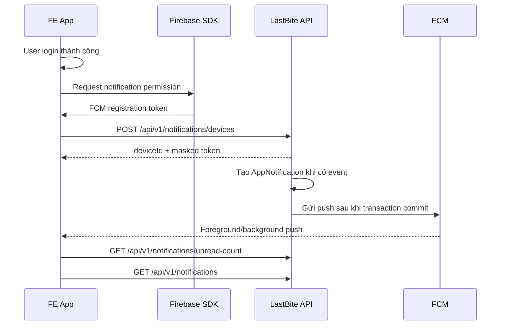

# LastBite FCM Push Notification Frontend Integration

Tài liệu này dành cho FE web/mobile app khi tích hợp Firebase Cloud Messaging với LastBite backend.
Backend hiện hỗ trợ 2 lớp thông báo:

- Inbox trong app: luôn được tạo trong database để user có thể xem lại.
- Push qua FCM: gửi tới device token đang active nếu FCM được cấu hình và user bật preference.

## 1. Luồng Chuẩn FE Cần Làm



Quy tắc quan trọng: FE không tự tạo notification. FE chỉ đăng ký device token, hiển thị push nhận từ FCM, và đồng bộ inbox từ backend.

## 2. Firebase Client Setup

### Web

Cần có Firebase web config và Web Push certificate/VAPID key từ Firebase Console.

File gợi ý:

```text
src/lib/firebase.ts
public/firebase-messaging-sw.js
```

Ví dụ client init:

```ts
import { initializeApp } from 'firebase/app';
import { getMessaging, getToken, onMessage, isSupported } from 'firebase/messaging';

const firebaseConfig = {
  apiKey: import.meta.env.VITE_FIREBASE_API_KEY,
  authDomain: import.meta.env.VITE_FIREBASE_AUTH_DOMAIN,
  projectId: import.meta.env.VITE_FIREBASE_PROJECT_ID,
  messagingSenderId: import.meta.env.VITE_FIREBASE_MESSAGING_SENDER_ID,
  appId: import.meta.env.VITE_FIREBASE_APP_ID,
};

export async function getFcmToken() {
  if (!(await isSupported())) return null;

  const app = initializeApp(firebaseConfig);
  const messaging = getMessaging(app);

  const permission = await Notification.requestPermission();
  if (permission !== 'granted') return null;

  return getToken(messaging, {
    vapidKey: import.meta.env.VITE_FIREBASE_VAPID_KEY,
    serviceWorkerRegistration: await navigator.serviceWorker.register('/firebase-messaging-sw.js'),
  });
}

export async function listenForegroundMessages(handler: (payload: any) => void) {
  if (!(await isSupported())) return;
  const messaging = getMessaging();
  onMessage(messaging, handler);
}
```

Service worker tối thiểu:

```js
// public/firebase-messaging-sw.js
importScripts('https://www.gstatic.com/firebasejs/10.13.2/firebase-app-compat.js');
importScripts('https://www.gstatic.com/firebasejs/10.13.2/firebase-messaging-compat.js');

firebase.initializeApp({
  apiKey: '...',
  authDomain: '...',
  projectId: '...',
  messagingSenderId: '...',
  appId: '...',
});

const messaging = firebase.messaging();

messaging.onBackgroundMessage((payload) => {
  const title = payload.notification?.title || payload.data?.title || 'LastBite';
  const options = {
    body: payload.notification?.body || payload.data?.body,
    icon: '/icons/icon-192.png',
    data: payload.data,
  };
  self.registration.showNotification(title, options);
});

self.addEventListener('notificationclick', (event) => {
  event.notification.close();
  const deepLink = event.notification.data?.deepLink || '/notifications';
  event.waitUntil(clients.openWindow(deepLink));
});
```

### React Native / Mobile

- Android: thêm `google-services.json`, Firebase Messaging SDK, xin quyền notification trên Android 13+.
- iOS: thêm `GoogleService-Info.plist`, bật Push Notifications + Background Modes, cấu hình APNs trong Firebase.
- Sau login và mỗi lần token refresh, gọi API đăng ký device token.

## 3. Register Device Token

Gọi sau khi login thành công và có access token.

```http
POST /api/v1/notifications/devices
Authorization: Bearer <accessToken>
Content-Type: application/json

{
  "deviceToken": "<fcm-registration-token>",
  "deviceType": "WEB",
  "appVersion": "1.0.0"
}
```

`deviceType` nhận một trong:

- `WEB`
- `ANDROID`
- `IOS`

Response:

```json
{
  "code": 1000,
  "message": "Device token registered",
  "result": {
    "id": "device-uuid",
    "deviceToken": "masked-token",
    "deviceType": "WEB",
    "appVersion": "1.0.0",
    "active": true,
    "lastSeenAt": "2026-06-23T05:00:00Z",
    "createdAt": "2026-06-23T05:00:00Z"
  }
}
```

FE nên lưu `deviceId` local theo device/browser để logout đúng device.

## 4. Logout Và Token Lifecycle

### Logout thiết bị hiện tại

```http
DELETE /api/v1/notifications/devices/{deviceId}
Authorization: Bearer <accessToken>
```

### Logout tất cả thiết bị

```http
DELETE /api/v1/notifications/devices
Authorization: Bearer <accessToken>
```

### Khi FCM token refresh

Nếu Firebase trả token mới, gọi lại `POST /notifications/devices`. Backend sẽ upsert/refresh token active.

## 5. Inbox APIs

Tất cả endpoint dưới đây cần `Authorization: Bearer <accessToken>`.

| Mục đích | Endpoint |
| --- | --- |
| List inbox | `GET /api/v1/notifications?page=0&size=20` |
| List unread | `GET /api/v1/notifications/unread` |
| Unread count | `GET /api/v1/notifications/unread-count` |
| Mark one read | `PATCH /api/v1/notifications/{notificationId}/read` |
| Mark all read | `PATCH /api/v1/notifications/read-all` |
| Delete one | `DELETE /api/v1/notifications/{notificationId}` |
| List preferences | `GET /api/v1/notifications/preferences` |
| Update preference | `PUT /api/v1/notifications/preferences` |

Inbox item shape:

```json
{
  "id": "notification-uuid",
  "type": "PAYMENT_SUCCESS",
  "category": "ORDER",
  "title": "Thanh toan thanh cong",
  "body": "Don LB-12345678 da duoc thanh toan...",
  "imageUrl": null,
  "deepLink": "/orders/order-uuid",
  "referenceType": "ORDER",
  "referenceId": "order-uuid",
  "payload": {
    "orderId": "order-uuid",
    "orderNumber": "LB-12345678",
    "storeId": "store-uuid",
    "storeName": "Banh Mi Sai Gon"
  },
  "read": false,
  "readAt": null,
  "createdAt": "2026-06-23T05:00:00Z"
}
```

FE nên render theo `type`, dùng `deepLink` để điều hướng, và fallback sang `referenceType/referenceId` nếu route thay đổi.

## 6. Preferences

Categories hiện có:

- `ORDER`
- `PICKUP`
- `PROMOTION`
- `STORE`
- `MERCHANT`
- `SYSTEM`

Update preference:

```http
PUT /api/v1/notifications/preferences
Authorization: Bearer <accessToken>
Content-Type: application/json

{
  "category": "PROMOTION",
  "pushEnabled": false,
  "emailEnabled": false
}
```

Lưu ý: preference ảnh hưởng push delivery. Inbox notification vẫn có thể được tạo cho các notification transactional để user không mất lịch sử quan trọng.

## 7. Notification Types FE Nên Support

### Customer order/payment

- `ORDER_RESERVED`
- `PAYMENT_EXPIRING`
- `PAYMENT_SUCCESS`
- `PAYMENT_FAILED`
- `ORDER_EXPIRED`
- `ORDER_CANCELLED`
- `ORDER_REFUNDED`
- `ORDER_READY_FOR_PICKUP`
- `ORDER_PICKED_UP`
- `ORDER_MISSED_PICKUP`
- `ORDER_DELEGATE_PICKUP`
- `IMPACT_MILESTONE`

### Customer pickup reminders

- `PICKUP_REMINDER_60M`
- `PICKUP_REMINDER_30M`
- `PICKUP_REMINDER_10M`
- `PICKUP_WINDOW_OPEN`
- `PICKUP_ENDING_SOON`

### Customer promo/store

- `FAVORITE_STORE_STOCK_AVAILABLE`
- `VOUCHER_AVAILABLE`
- `LOW_STOCK_ALERT`
- `LAST_CHANCE_TODAY`
- `NEW_BAG_FROM_FAVORITE_STORE`

### Merchant

- `MERCHANT_NEW_PAID_ORDER`
- `MERCHANT_ORDER_PICKED_UP`
- `MERCHANT_ORDER_EXPIRED`
- `MERCHANT_STOCK_LOW`
- `MERCHANT_SET_STOCK_REMINDER`
- `MERCHANT_STORE_APPROVED`
- `MERCHANT_STORE_REJECTED`
- `MERCHANT_BAG_PAUSED`
- `MERCHANT_BAG_RESUMED`
- `MERCHANT_CAMPAIGN_STARTED`

### Admin

- `ADMIN_STORE_PENDING_REVIEW`
- `ADMIN_REFUND_REQUIRED`

## 8. Current Backend Triggers

| Backend event | Notification type |
| --- | --- |
| Customer reserves bag | `ORDER_RESERVED` |
| Payment expires soon | `PAYMENT_EXPIRING` |
| PayOS payment success | `PAYMENT_SUCCESS`, `MERCHANT_NEW_PAID_ORDER` |
| PayOS payment failed webhook | `PAYMENT_FAILED` |
| Pending payment expired | `ORDER_EXPIRED` |
| Merchant confirms pickup | `ORDER_PICKED_UP`, `MERCHANT_ORDER_PICKED_UP`, optional `IMPACT_MILESTONE` |
| No-show expired | `ORDER_MISSED_PICKUP`, `MERCHANT_ORDER_EXPIRED` |
| Stock available for favorite store | `FAVORITE_STORE_STOCK_AVAILABLE` |
| Stock remaining is 1-2 after order | `MERCHANT_STOCK_LOW` |
| Merchant bag paused/resumed | `MERCHANT_BAG_PAUSED`, `MERCHANT_BAG_RESUMED` |
| Store submitted for review | `ADMIN_STORE_PENDING_REVIEW` |
| Store approved/rejected | `MERCHANT_STORE_APPROVED`, `MERCHANT_STORE_REJECTED` |
| Voucher claimed/reissued | `VOUCHER_AVAILABLE` |
| Shared campaign approved | `MERCHANT_CAMPAIGN_STARTED` |
| Refund transaction failed | `ADMIN_REFUND_REQUIRED` |
| Daily 20:00 store reminder | `MERCHANT_SET_STOCK_REMINDER` |

## 9. FE Handling Rules

1. On app boot after auth restore: register/refresh FCM token if permission is granted.
2. On login: request permission only after user action or after a soft prompt.
3. On foreground push: show in-app toast/banner and refresh unread count.
4. On notification click: navigate by `deepLink`.
5. On app resume: call `GET /notifications/unread-count`.
6. On notification screen open: call paginated inbox API.
7. Do not rely only on FCM. Always use inbox API as source of truth.
8. If POST device fails with 401, refresh auth token and retry once.
9. If browser denies permission, keep inbox working and do not spam permission prompts.

## 10. Backend Env Checklist

Backend staging/prod cần:

```env
APP_FCM_ENABLED=true
APP_FCM_CREDENTIALS_PATH=/secure/path/firebase-admin.json
# or
APP_FCM_CREDENTIALS_BASE64=<base64-json>
APP_NOTIFICATIONS_REMINDER_FIXED_DELAY_MS=60000
```

Không commit Firebase service account JSON vào repo.