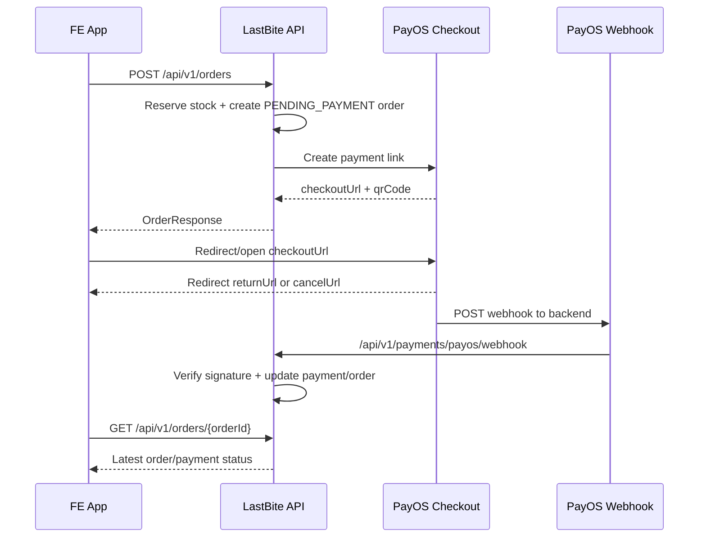

# LastBite PayOS Frontend Integration Guide

Tài liệu này mô tả flow FE app cần implement khi thanh toán đơn LastBite qua PayOS.
Backend là bên tạo payment link, verify webhook, cập nhật order/payment, release stock và gửi notification. FE không gọi trực tiếp PayOS API bằng client id/api key.

## 1. Tổng Quan Flow



Nguồn sự thật cuối cùng là backend order detail, không phải query param của PayOS return URL.

## 2. Backend Config FE Cần Biết

Backend config PayOS:

```env
APP_PAYMENTS_GATEWAY=payos
APP_PAYMENTS_RETURN_URL=https://your-fe.app/orders/payment-return
APP_PAYMENTS_CANCEL_URL=https://your-fe.app/orders/payment-cancel
APP_PAYMENTS_PAYOS_BASE_URL=https://api-merchant.payos.vn
APP_PAYMENTS_PAYOS_CLIENT_ID=...
APP_PAYMENTS_PAYOS_API_KEY=...
APP_PAYMENTS_PAYOS_CHECKSUM_KEY=...
```

Local default trong code:

```text
returnUrl = http://localhost:3000/orders/payment-return
cancelUrl = http://localhost:3000/orders/payment-cancel
```

FE phải tạo route đúng với return/cancel URL backend đang cấu hình.

## 3. Tạo Order Và Payment Link

Endpoint:

```http
POST /api/v1/orders
Authorization: Bearer <customerAccessToken>
Content-Type: application/json

{
  "bagId": "bag-uuid",
  "quantity": 1,
  "idempotencyKey": "client-generated-key",
  "voucherCode": "SAVE20",
  "userVoucherId": null
}
```

Field rules:

| Field | Required | Notes |
| --- | --- | --- |
| `bagId` | Yes | Túi đang mở bán hôm nay. |
| `quantity` | Yes | 1-3, và không vượt `maxPerOrder` của bag. |
| `idempotencyKey` | Yes | FE tự sinh, tối đa 100 ký tự. Dùng để chống double submit. |
| `voucherCode` | Optional | Không gửi cùng lúc với `userVoucherId`. |
| `userVoucherId` | Optional | Voucher đã claim trong wallet. |

Response thành công:

```json
{
  "code": 1000,
  "message": "Da giu tui, vui long thanh toan truoc khi het han",
  "result": {
    "id": "order-uuid",
    "orderNumber": "LB-1234ABCD",
    "status": "PENDING_PAYMENT",
    "paymentStatus": "PENDING",
    "paymentProvider": "PAYOS",
    "paymentOrderCode": 1234567890,
    "checkoutUrl": "https://pay.payos.vn/web/...",
    "paymentQrCode": "...",
    "reservedUntil": "2026-06-23T05:10:00Z",
    "paymentExpiresAt": "2026-06-23T05:10:00Z",
    "finalAmount": 50000,
    "pickupCode": "ABC123",
    "pickupQrToken": "pk_..."
  }
}
```

FE phải lưu tối thiểu:

- `orderId`
- `orderNumber`
- `checkoutUrl`
- `paymentExpiresAt`
- `idempotencyKey`

## 4. Idempotency Key Chuẩn FE

Mỗi lần user bấm đặt một bag mới, sinh key mới. Nếu user double click hoặc retry request vì network timeout, dùng lại cùng key.

Ví dụ:

```ts
function createOrderIdempotencyKey(userId: string, bagId: string) {
  return `order:${userId}:${bagId}:${crypto.randomUUID()}`;
}
```

Không reuse key cho order mới khác. Nếu reuse, backend sẽ trả lại order cũ.

## 5. Mở PayOS Checkout

Sau khi nhận `checkoutUrl`, FE có 2 cách:

### Web

```ts
window.location.href = order.checkoutUrl;
```

Hoặc mở tab mới nếu UX yêu cầu:

```ts
window.open(order.checkoutUrl, '_blank', 'noopener,noreferrer');
```

### Mobile

- Dùng in-app browser/custom tab nếu có.
- Không nhúng API key PayOS vào app.
- Sau return/cancel deep link, app gọi lại backend để lấy trạng thái mới nhất.

## 6. Return URL Page

Route FE ví dụ:

```text
/orders/payment-return
```

Khi user quay lại từ PayOS, FE không được tự kết luận thanh toán thành công chỉ vì vào return page. Webhook có thể tới trước hoặc sau redirect.

Flow nên làm:

1. Lấy `orderId` từ local/session state trước khi redirect, hoặc từ query nếu FE tự attach state ở return URL.
2. Gọi `GET /api/v1/orders/{orderId}`.
3. Nếu `paymentStatus=SUCCEEDED` và `status=PAID`, hiển thị success.
4. Nếu vẫn `PENDING`, poll vài lần.
5. Nếu `FAILED`, `EXPIRED`, `CANCELLED`, hiển thị trạng thái tương ứng.

Ví dụ polling:

```ts
async function waitForPaymentResult(orderId: string) {
  const delays = [1000, 1500, 2000, 3000, 5000, 8000];

  for (const delay of delays) {
    const order = await api.getOrder(orderId);
    if (['SUCCEEDED', 'FAILED', 'EXPIRED', 'CANCELLED'].includes(order.paymentStatus)) {
      return order;
    }
    await new Promise((resolve) => setTimeout(resolve, delay));
  }

  return api.getOrder(orderId);
}
```

UI copy gợi ý khi webhook chưa tới:

```text
Chúng tôi đang xác nhận thanh toán từ PayOS. Vui lòng chờ vài giây.
```

## 7. Cancel URL Page

Route FE ví dụ:

```text
/orders/payment-cancel
```

User bấm hủy/đóng checkout ở PayOS không nhất thiết backend đã cancel order ngay. FE nên:

1. Gọi `GET /api/v1/orders/{orderId}`.
2. Nếu order vẫn `PENDING_PAYMENT`, cho user chọn:
   - Quay lại thanh toán bằng `checkoutUrl` cũ nếu còn hạn.
   - Hủy order bằng `POST /api/v1/orders/{orderId}/cancel`.
3. Nếu `paymentExpiresAt` đã qua, hiển thị order hết hạn và gợi ý đặt lại.

Không tự gọi webhook endpoint từ FE.

## 8. Order Detail Endpoint Dùng Để Poll

```http
GET /api/v1/orders/{orderId}
Authorization: Bearer <customerAccessToken>
```

Các status FE cần xử lý:

### `OrderStatus`

- `PENDING_PAYMENT`: đã giữ túi, đang chờ thanh toán.
- `PAID`: đã thanh toán, chờ đến giờ pickup hoặc merchant chuẩn bị.
- `READY_FOR_PICKUP`: merchant đã đánh dấu sẵn sàng.
- `PICKED_UP`: đã nhận hàng.
- `EXPIRED`: hết hạn thanh toán hoặc no-show pickup.
- `CANCELLED`: đã hủy.
- `REFUNDED`: đã hoàn tiền.

### `PaymentStatus`

- `PENDING`: PayOS link đã tạo, đang chờ user trả tiền.
- `SUCCEEDED`: PayOS webhook thành công, order sẽ là `PAID` nếu còn hạn.
- `FAILED`: PayOS báo thất bại.
- `EXPIRED`: quá hạn thanh toán, stock được release.
- `CANCELLED`: user/backend cancel pending payment.
- `REFUNDED` / `PARTIALLY_REFUNDED`: refund đã xử lý.

## 9. Countdown Thanh Toán

Backend reservation TTL hiện là 10 phút theo order service. FE nên dùng `paymentExpiresAt` hoặc `reservedUntil` từ response, không hard-code 10 phút.

```ts
const expiresAt = new Date(order.paymentExpiresAt ?? order.reservedUntil).getTime();
const remainingMs = Math.max(0, expiresAt - Date.now());
```

Khi countdown về 0:

1. Disable nút thanh toán.
2. Gọi `GET /orders/{orderId}` để xác nhận backend đã expire chưa.
3. Nếu vẫn pending trong vài giây đầu, hiển thị trạng thái đang cập nhật và poll nhẹ.

Backend job expire chạy theo fixed delay, nên có thể lệch tối đa khoảng 60 giây tùy cấu hình.

## 10. Retry Thanh Toán

Nếu order vẫn `PENDING_PAYMENT` và `paymentStatus=PENDING`, FE có thể cho user mở lại `checkoutUrl` cũ.

Không tạo order mới chỉ vì user đóng PayOS. Tạo order mới chỉ khi:

- order cũ đã `EXPIRED`/`CANCELLED`, hoặc
- user đổi bag/quantity/voucher.

## 11. Hủy Order Từ FE

Endpoint:

```http
POST /api/v1/orders/{orderId}/cancel
Authorization: Bearer <customerAccessToken>
```

Backend behavior:

- Nếu `PENDING_PAYMENT`: release stock, release voucher reservation, cancel PayOS payment link.
- Nếu `PAID`: chỉ cho hủy trước pickup window ít nhất 2 giờ, backend tạo auto-refund.
- Nếu không hủy được, backend trả lỗi `INVALID_INPUT`.

FE nên refresh order detail sau khi cancel thành công.

## 12. Notifications Liên Quan Payment

Backend sẽ tạo inbox/push nếu user đã đăng ký FCM:

| Event | Notification |
| --- | --- |
| Giữ túi thành công | `ORDER_RESERVED` |
| Gần hết hạn thanh toán | `PAYMENT_EXPIRING` |
| Thanh toán thành công | `PAYMENT_SUCCESS` |
| Thanh toán thất bại | `PAYMENT_FAILED` |
| Hết hạn thanh toán | `ORDER_EXPIRED` |
| Merchant có đơn mới đã trả tiền | `MERCHANT_NEW_PAID_ORDER` |

FE nên refresh order detail khi nhận các push này nếu user đang đứng ở màn order/payment.

## 13. FE State Machine Gợi Ý

```ts
type CheckoutUiState =
  | 'creating_order'
  | 'waiting_payment'
  | 'redirecting_payos'
  | 'confirming_payment'
  | 'paid'
  | 'failed'
  | 'expired'
  | 'cancelled';

function stateFromOrder(order: OrderResponse): CheckoutUiState {
  if (order.status === 'PAID' || order.paymentStatus === 'SUCCEEDED') return 'paid';
  if (order.status === 'EXPIRED' || order.paymentStatus === 'EXPIRED') return 'expired';
  if (order.status === 'CANCELLED' || order.paymentStatus === 'CANCELLED') return 'cancelled';
  if (order.paymentStatus === 'FAILED') return 'failed';
  return 'waiting_payment';
}
```

## 14. Error Handling

| Case | FE xử lý |
| --- | --- |
| `401` | Refresh token rồi retry một lần. |
| `STOCK_CONFLICT` | Bag hết/không đủ số lượng, quay về detail và refresh stock. |
| `INVALID_INPUT` khi dùng voucher | Xóa voucher khỏi checkout, yêu cầu user chọn lại. |
| `SERVICE_UNAVAILABLE` khi tạo payment link | Giữ user ở checkout, cho retry với cùng idempotency key. |
| Network timeout sau `POST /orders` | Retry với cùng idempotency key. |
| Return page nhưng order vẫn pending | Poll trạng thái; không báo success sớm. |

## 15. Không Làm Những Việc Này Ở FE

- Không gọi `/api/v1/payments/payos/webhook` từ FE.
- Không lưu PayOS `clientId`, `apiKey`, `checksumKey` trong app.
- Không tự set order là paid dựa trên query param return URL.
- Không tạo order mới khi user chỉ refresh return page.
- Không bỏ qua `paymentExpiresAt`; checkout link có thể hết hạn.

## 16. Checklist FE

- Có route `/orders/payment-return`.
- Có route `/orders/payment-cancel`.
- Checkout screen sinh `idempotencyKey` ổn định cho từng attempt.
- Sau `POST /orders`, lưu `orderId` trước khi redirect PayOS.
- Return/cancel page gọi `GET /orders/{orderId}`.
- Có polling ngắn khi trạng thái còn pending.
- Có countdown theo `paymentExpiresAt`.
- Có retry mở lại `checkoutUrl` khi order còn pending.
- Có cancel order endpoint cho user muốn hủy pending payment.
- Có handler FCM để refresh order khi nhận `PAYMENT_SUCCESS`, `PAYMENT_FAILED`, `ORDER_EXPIRED`.